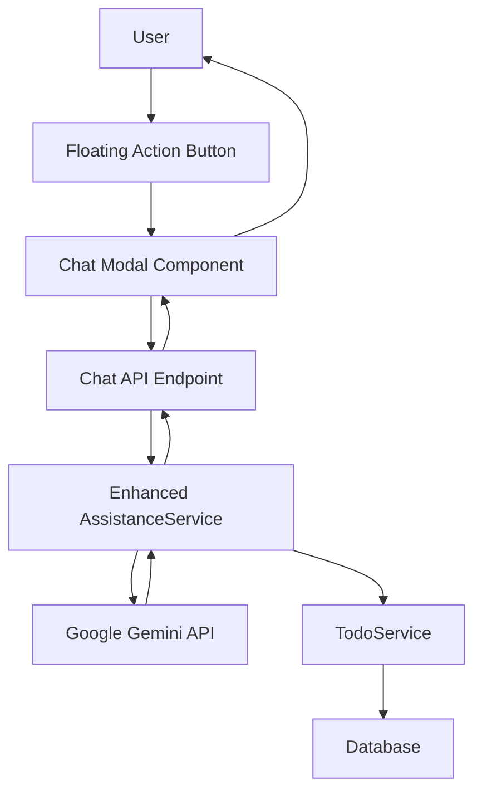
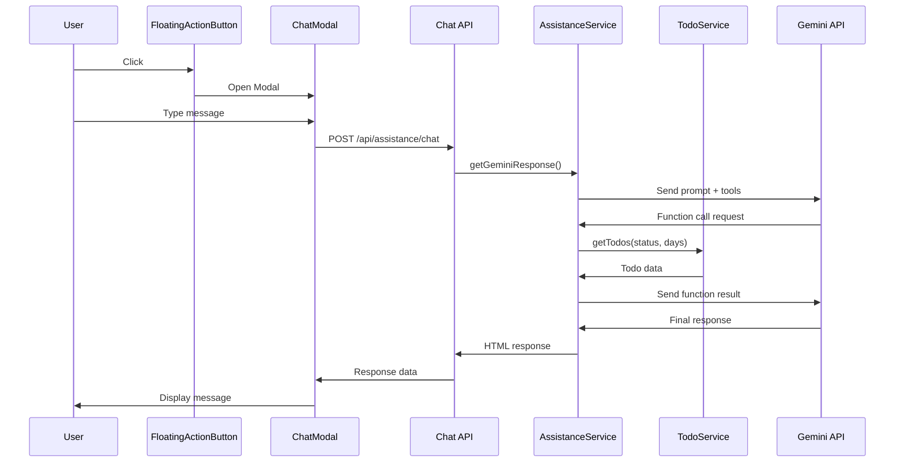

# Design Document

## Overview

The AI Assistant Chat Interface will provide users with a conversational interface to interact with their todo data using natural language queries in Korean. The feature builds upon the existing AssistanceService and integrates a new chat UI component into the TodoList application. The design leverages Google Gemini's function calling capabilities to provide intelligent, data-driven responses.

## Architecture

### High-Level Architecture



### Component Interaction Flow



## Components and Interfaces

### Frontend Components

#### 1. FloatingActionButton Component
- **Location**: `client/src/components/FloatingActionButton.js`
- **Purpose**: Fixed-position trigger for chat interface
- **Props**:
  - `isOpen: boolean` - Controls icon state (chat/close)
  - `onClick: () => void` - Click handler
- **Styling**: Fixed bottom-right position with z-index for overlay

#### 2. ChatModal Component
- **Location**: `client/src/components/ChatModal.js`
- **Purpose**: Main chat interface container
- **Props**:
  - `isOpen: boolean` - Controls modal visibility
  - `onClose: () => void` - Close handler
  - `user: UserEntity` - Current user context
- **State Management**:
  - `messages: Message[]` - Conversation history (persisted via Zustand)
  - `inputValue: string` - Current input text
  - `isLoading: boolean` - API request state

#### 3. ChatMessage Component
- **Location**: `client/src/components/ChatMessage.js`
- **Purpose**: Individual message display
- **Props**:
  - `message: Message` - Message data
  - `isUser: boolean` - Message sender type
- **Features**: HTML rendering for AI responses, timestamp display

#### 4. Enhanced TodoContainer Integration
- **Location**: `client/src/todoList/TodoList.js`
- **Changes**: Add FloatingActionButton and ChatModal to existing component
- **State**: Add `isChatOpen: boolean` state

#### 5. Chat Store (Zustand)
- **Location**: `client/src/stores/chatStore.js`
- **Purpose**: Persistent chat state management using Zustand
- **Features**: Session storage persistence, message history, loading states
- **Persistence**: Uses Zustand persist middleware with sessionStorage

### Backend Enhancements

#### 1. Enhanced AssistanceService
- **Location**: `src/src/assistance/assistance.service.ts`
- **New Method**: `getChatResponse(userSeq: number, prompt: string)`
- **Function Calling Integration**: Add getTodos tool definition
- **Dependencies**: Inject TodoService for data access

#### 2. New Chat Controller
- **Location**: `src/src/assistance/chat.controller.ts`
- **Endpoint**: `POST /api/assistance/chat`
- **Authentication**: Session-based auth guard
- **Request/Response**: ChatRequestDto/ChatResponseDto

#### 3. TodoService Enhancement
- **Location**: `src/src/todo/todo.service.ts`
- **New Method**: `getTodos(userSeq: number, status?: string, days?: number)`
- **Purpose**: Flexible todo querying for AI function calls
- **Return**: Structured todo data for AI context

## Data Models

### Frontend Data Models

```typescript
interface Message {
  id: string;
  content: string;
  isUser: boolean;
  timestamp: Date;
  isHtml?: boolean; // For AI responses
}

interface ChatState {
  messages: Message[];
  isLoading: boolean;
  error: string | null;
  addMessage: (message: Omit<Message, 'id' | 'timestamp'>) => void;
  setLoading: (loading: boolean) => void;
  setError: (error: string | null) => void;
  clearMessages: () => void;
}

// Zustand Store Configuration
interface ChatStore extends ChatState {
  // Persisted state (messages)
  // Non-persisted state (isLoading, error)
  // Actions for state management
}
```

### Backend DTOs

```typescript
class ChatRequestDto {
  prompt: string;
}

class ChatResponseDto {
  response: string;
  timestamp: string;
  success: boolean;
  error?: string;
}

class TodoSummaryDto {
  todoSeq: number;
  todoContent: string;
  todoDate: string;
  completeDtm: string | null;
  isOverdue: boolean;
}
```

### Gemini Function Tool Definition

```typescript
const getTodosTool = {
  functionDeclarations: [{
    name: 'getTodos',
    description: '사용자의 할 일 목록을 DB에서 조회합니다.',
    parameters: {
      type: 'OBJECT',
      properties: {
        status: {
          type: 'STRING',
          description: "조회할 할 일의 상태. 'completed' (완료), 'incomplete' (미완료), 'overdue' (지연). 지정하지 않으면 모든 상태.",
        },
        days: {
          type: 'NUMBER',
          description: '조회할 기간(일). (예: 7은 지난 7일, -7은 향후 7일). 지정하지 않으면 전체 기간.',
        },
      },
    },
  }],
};
```

## Error Handling

### Frontend Error Handling
- **Network Errors**: Display user-friendly Korean error messages
- **API Errors**: Show specific error from server response
- **Loading States**: Prevent multiple simultaneous requests
- **Input Validation**: Trim whitespace, prevent empty messages

### Backend Error Handling
- **Gemini API Failures**: Fallback to generic helpful message
- **Database Errors**: Log error, return user-friendly message
- **Authentication Errors**: Return 401 with redirect instruction
- **Rate Limiting**: Implement request throttling per user

### Error Messages (Korean)
```typescript
const ERROR_MESSAGES = {
  NETWORK_ERROR: '네트워크 연결을 확인해주세요.',
  API_ERROR: 'AI 서비스에 일시적인 문제가 발생했습니다.',
  AUTH_ERROR: '로그인이 필요합니다.',
  RATE_LIMIT: '잠시 후 다시 시도해주세요.',
  GENERIC_ERROR: '문제가 발생했습니다. 다시 시도해주세요.'
};
```

## Testing Strategy

### Frontend Testing
- **Unit Tests**: Component rendering, state management, user interactions
- **Integration Tests**: API communication, error handling
- **Accessibility Tests**: Keyboard navigation, screen reader compatibility
- **Responsive Tests**: Mobile and desktop layout validation

### Backend Testing
- **Unit Tests**: Service methods, DTO validation, error handling
- **Integration Tests**: Gemini API communication, database queries
- **E2E Tests**: Complete chat flow from request to response
- **Security Tests**: Authentication, input sanitization

### Test Scenarios
1. **Happy Path**: User asks about todos, receives relevant response
2. **Function Calling**: AI requests todo data, processes and responds
3. **Error Scenarios**: Network failures, invalid inputs, API errors
4. **Edge Cases**: Empty todo lists, long conversations, special characters
5. **Security**: XSS prevention, authentication bypass attempts

## Dependencies

### Frontend Dependencies
- **Zustand**: State management library (already in project)
- **Zustand Persist Middleware**: For session storage persistence
- **React Bootstrap**: UI components (already in project)
- **Bootstrap Icons**: Chat and close icons (already in project)

## Performance Considerations

### Frontend Optimization
- **Lazy Loading**: Load chat components only when needed
- **Message Virtualization**: Handle long conversation histories
- **Debounced Input**: Prevent excessive API calls during typing
- **Caching**: Store conversation using Zustand persist middleware with session storage

### Backend Optimization
- **Request Throttling**: Limit requests per user per minute
- **Response Caching**: Cache common AI responses temporarily
- **Database Optimization**: Efficient todo queries with proper indexing
- **Connection Pooling**: Manage Gemini API connections efficiently

## Security Considerations

### Input Sanitization
- **Frontend**: Sanitize user input before sending to API
- **Backend**: Validate and sanitize all incoming requests
- **AI Responses**: Already sanitized using sanitize-html library

### Authentication & Authorization
- **Session Validation**: Verify user session for all chat requests
- **User Context**: Ensure users only access their own todo data
- **Rate Limiting**: Prevent abuse of AI service

### Data Privacy
- **Conversation Storage**: Do not persist chat history
- **API Key Security**: Store API key securely in environment variables
- **User Data**: Only send necessary todo data to Gemini API

## Accessibility Features

### Keyboard Navigation
- **Tab Order**: Logical tab sequence through chat interface
- **Enter Key**: Send message on Enter, Shift+Enter for new line
- **Escape Key**: Close modal
- **Focus Management**: Proper focus handling on modal open/close

### Screen Reader Support
- **ARIA Labels**: Descriptive labels for all interactive elements
- **Live Regions**: Announce new messages to screen readers
- **Semantic HTML**: Proper heading structure and landmarks
- **Alt Text**: Descriptive text for icons and visual elements

### Visual Accessibility
- **High Contrast**: Ensure sufficient color contrast ratios
- **Font Scaling**: Support browser font size adjustments
- **Focus Indicators**: Clear visual focus indicators
- **Reduced Motion**: Respect user motion preferences