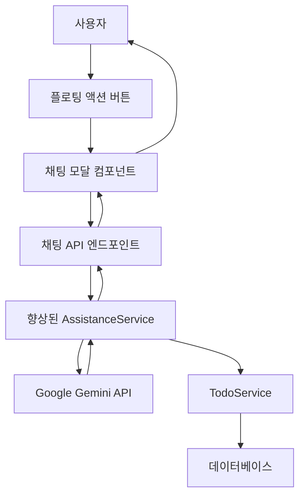
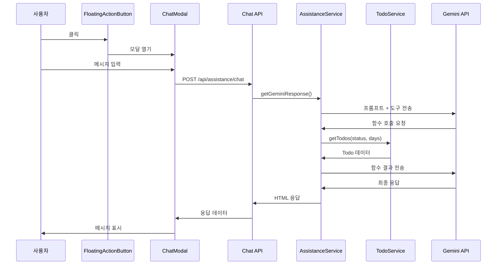

# 설계 문서

## 개요

AI 어시스턴트 채팅 인터페이스는 사용자에게 한국어 자연어 쿼리를 사용하여 todo 데이터와 상호 작용할 수 있는 대화형 인터페이스를 제공합니다. 이 기능은 기존 AssistanceService를 기반으로 하며 새로운 채팅 UI 컴포넌트를 TodoList 애플리케이션에 통합합니다. 설계는 Google Gemini의 함수 호출 기능을 활용하여 지능적이고 데이터 기반 응답을 제공합니다.

## 아키텍처

### 고수준 아키텍처



### 컴포넌트 상호작용 흐름



## 컴포넌트 및 인터페이스

### 프론트엔드 컴포넌트

#### 1. FloatingActionButton 컴포넌트
- **위치**: `client/src/components/FloatingActionButton.js`
- **목적**: 채팅 인터페이스를 위한 고정 위치 트리거
- **Props**:
  - `isOpen: boolean` - 아이콘 상태 제어(채팅/닫기)
  - `onClick: () => void` - 클릭 핸들러
- **스타일링**: 오버레이를 위한 z-index로 고정 오른쪽 하단 위치

#### 2. ChatModal 컴포넌트
- **위치**: `client/src/components/ChatModal.js`
- **목적**: 메인 채팅 인터페이스 컨테이너
- **Props**:
  - `isOpen: boolean` - 모달 가시성 제어
  - `onClose: () => void` - 닫기 핸들러
  - `user: UserEntity` - 현재 사용자 컨텍스트
- **상태 관리**:
  - `messages: Message[]` - 대화 기록(Zustand를 통해 지속됨)
  - `inputValue: string` - 현재 입력 텍스트
  - `isLoading: boolean` - API 요청 상태

#### 3. ChatMessage 컴포넌트
- **위치**: `client/src/components/ChatMessage.js`
- **목적**: 개별 메시지 표시
- **Props**:
  - `message: Message` - 메시지 데이터
  - `isUser: boolean` - 메시지 발신자 유형
- **기능**: AI 응답을 위한 HTML 렌더링, 타임스탬프 표시

#### 4. 향상된 TodoContainer 통합
- **위치**: `client/src/todoList/TodoList.js`
- **변경사항**: 기존 컴포넌트에 FloatingActionButton 및 ChatModal 추가
- **상태**: `isChatOpen: boolean` 상태 추가

#### 5. 채팅 스토어 (Zustand)
- **위치**: `client/src/stores/chatStore.js`
- **목적**: Zustand를 사용한 지속적인 채팅 상태 관리
- **기능**: 세션 스토리지 지속성, 메시지 기록, 로딩 상태
- **지속성**: sessionStorage와 함께 Zustand persist 미들웨어 사용

### 백엔드 개선사항

#### 1. 향상된 AssistanceService
- **위치**: `src/src/assistance/assistance.service.ts`
- **새 메서드**: `getChatResponse(userSeq: number, prompt: string)`
- **함수 호출 통합**: getTodos 도구 정의 추가
- **의존성**: 데이터 액세스를 위한 TodoService 주입

#### 2. 새 채팅 컨트롤러
- **위치**: `src/src/assistance/chat.controller.ts`
- **엔드포인트**: `POST /api/assistance/chat`
- **인증**: 세션 기반 인증 가드
- **요청/응답**: ChatRequestDto/ChatResponseDto

#### 3. TodoService 개선
- **위치**: `src/src/todo/todo.service.ts`
- **새 메서드**: `getTodos(userSeq: number, status?: string, days?: number)`
- **목적**: AI 함수 호출을 위한 유연한 todo 쿼리
- **반환**: AI 컨텍스트를 위한 구조화된 todo 데이터

## 데이터 모델

### 프론트엔드 데이터 모델

```typescript
interface Message {
  id: string;
  content: string;
  isUser: boolean;
  timestamp: Date;
  isHtml?: boolean; // AI 응답용
}

interface ChatState {
  messages: Message[];
  isLoading: boolean;
  error: string | null;
  addMessage: (message: Omit<Message, 'id' | 'timestamp'>) => void;
  setLoading: (loading: boolean) => void;
  setError: (error: string | null) => void;
  clearMessages: () => void;
}

// Zustand 스토어 구성
interface ChatStore extends ChatState {
  // 지속되는 상태 (messages)
  // 지속되지 않는 상태 (isLoading, error)
  // 상태 관리를 위한 액션
}
```

### 백엔드 DTO

```typescript
class ChatRequestDto {
  prompt: string;
}

class ChatResponseDto {
  response: string;
  timestamp: string;
  success: boolean;
  error?: string;
}

class TodoSummaryDto {
  todoSeq: number;
  todoContent: string;
  todoDate: string;
  completeDtm: string | null;
  isOverdue: boolean;
}
```

### Gemini 함수 도구 정의

```typescript
const getTodosTool = {
  functionDeclarations: [{
    name: 'getTodos',
    description: '사용자의 할 일 목록을 DB에서 조회합니다.',
    parameters: {
      type: 'OBJECT',
      properties: {
        status: {
          type: 'STRING',
          description: "조회할 할 일의 상태. 'completed' (완료), 'incomplete' (미완료), 'overdue' (지연). 지정하지 않으면 모든 상태.",
        },
        days: {
          type: 'NUMBER',
          description: '조회할 기간(일). (예: 7은 지난 7일, -7은 향후 7일). 지정하지 않으면 전체 기간.',
        },
      },
    },
  }],
};
```

## 오류 처리

### 프론트엔드 오류 처리
- **네트워크 오류**: 사용자 친화적인 한국어 오류 메시지 표시
- **API 오류**: 서버 응답의 특정 오류 표시
- **로딩 상태**: 여러 동시 요청 방지
- **입력 유효성 검사**: 공백 제거, 빈 메시지 방지

### 백엔드 오류 처리
- **Gemini API 실패**: 일반적인 도움말 메시지로 폴백
- **데이터베이스 오류**: 오류 로그, 사용자 친화적인 메시지 반환
- **인증 오류**: 리디렉션 지시와 함께 401 반환
- **속도 제한**: 사용자당 요청 제한 구현

### 오류 메시지 (한국어)
```typescript
const ERROR_MESSAGES = {
  NETWORK_ERROR: '네트워크 연결을 확인해주세요.',
  API_ERROR: 'AI 서비스에 일시적인 문제가 발생했습니다.',
  AUTH_ERROR: '로그인이 필요합니다.',
  RATE_LIMIT: '잠시 후 다시 시도해주세요.',
  GENERIC_ERROR: '문제가 발생했습니다. 다시 시도해주세요.'
};
```

## 테스트 전략

### 프론트엔드 테스트
- **단위 테스트**: 컴포넌트 렌더링, 상태 관리, 사용자 상호작용
- **통합 테스트**: API 통신, 오류 처리
- **접근성 테스트**: 키보드 탐색, 스크린 리더 호환성
- **반응형 테스트**: 모바일 및 데스크톱 레이아웃 유효성 검사

### 백엔드 테스트
- **단위 테스트**: 서비스 메서드, DTO 유효성 검사, 오류 처리
- **통합 테스트**: Gemini API 통신, 데이터베이스 쿼리
- **E2E 테스트**: 요청부터 응답까지 완전한 채팅 흐름
- **보안 테스트**: 인증, 입력 새니타이제이션

### 테스트 시나리오
1. **해피 패스**: 사용자가 todo에 대해 질문하고 관련 응답을 받음
2. **함수 호출**: AI가 todo 데이터를 요청하고 처리하여 응답
3. **오류 시나리오**: 네트워크 실패, 잘못된 입력, API 오류
4. **엣지 케이스**: 빈 todo 목록, 긴 대화, 특수 문자
5. **보안**: XSS 방지, 인증 우회 시도

## 의존성

### 프론트엔드 의존성
- **Zustand**: 상태 관리 라이브러리(프로젝트에 이미 있음)
- **Zustand Persist 미들웨어**: 세션 스토리지 지속성용
- **React Bootstrap**: UI 컴포넌트(프로젝트에 이미 있음)
- **Bootstrap Icons**: 채팅 및 닫기 아이콘(프로젝트에 이미 있음)

## 성능 고려사항

### 프론트엔드 최적화
- **지연 로딩**: 필요할 때만 채팅 컴포넌트 로드
- **메시지 가상화**: 긴 대화 기록 처리
- **디바운스된 입력**: 입력 중 과도한 API 호출 방지
- **캐싱**: Zustand persist 미들웨어와 세션 스토리지를 사용하여 대화 저장

### 백엔드 최적화
- **요청 제한**: 사용자당 분당 요청 제한
- **응답 캐싱**: 일반적인 AI 응답을 일시적으로 캐시
- **데이터베이스 최적화**: 적절한 인덱싱으로 효율적인 todo 쿼리
- **연결 풀링**: Gemini API 연결을 효율적으로 관리

## 보안 고려사항

### 입력 새니타이제이션
- **프론트엔드**: API로 전송하기 전에 사용자 입력 새니타이즈
- **백엔드**: 모든 들어오는 요청 유효성 검사 및 새니타이즈
- **AI 응답**: sanitize-html 라이브러리를 사용하여 이미 새니타이즈됨

### 인증 및 권한 부여
- **세션 유효성 검사**: 모든 채팅 요청에 대한 사용자 세션 확인
- **사용자 컨텍스트**: 사용자가 자신의 todo 데이터만 액세스하도록 보장
- **속도 제한**: AI 서비스 남용 방지

### 데이터 프라이버시
- **대화 스토리지**: 채팅 기록을 지속하지 않음
- **API 키 보안**: 환경 변수에 API 키를 안전하게 저장
- **사용자 데이터**: 필요한 todo 데이터만 Gemini API로 전송

## 접근성 기능

### 키보드 탐색
- **탭 순서**: 채팅 인터페이스를 통한 논리적 탭 시퀀스
- **Enter 키**: Enter로 메시지 전송, Shift+Enter로 새 줄
- **Escape 키**: 모달 닫기
- **포커스 관리**: 모달 열기/닫기 시 적절한 포커스 처리

### 스크린 리더 지원
- **ARIA 레이블**: 모든 대화형 요소에 대한 설명적 레이블
- **라이브 영역**: 스크린 리더에 새 메시지 알림
- **시맨틱 HTML**: 적절한 제목 구조 및 랜드마크
- **대체 텍스트**: 아이콘 및 시각적 요소에 대한 설명 텍스트

### 시각적 접근성
- **고대비**: 충분한 색상 대비 비율 보장
- **글꼴 크기 조정**: 브라우저 글꼴 크기 조정 지원
- **포커스 표시기**: 명확한 시각적 포커스 표시기
- **모션 감소**: 사용자 모션 기본 설정 존중
