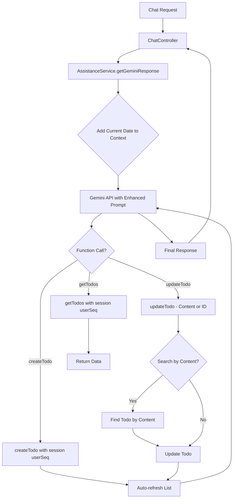
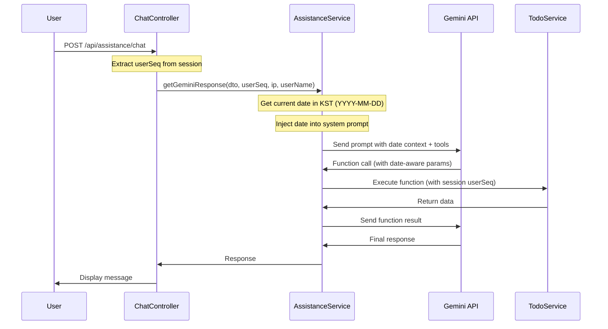
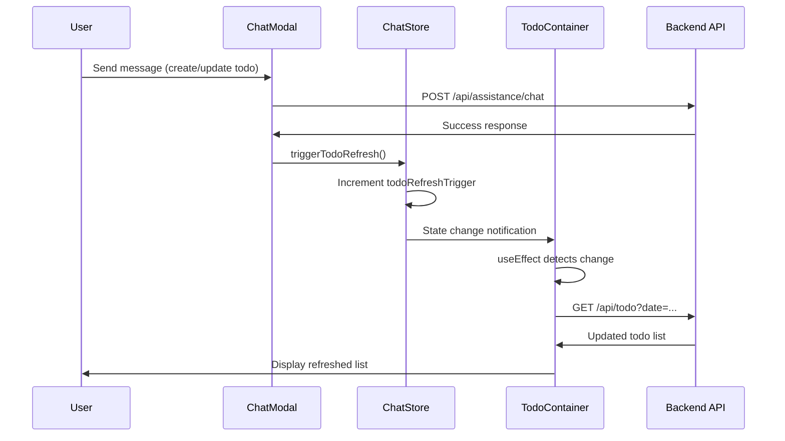

# Design Document

## Overview

This design document outlines the technical implementation for four critical enhancements to the AI Assistant Chat Interface: date awareness, content-based updates, proactive list refresh, and session-based security enforcement. These enhancements will improve the AI's temporal reasoning, make interactions more natural, provide better UX through automatic feedback, and ensure robust security.

## Architecture

### High-Level Component Changes



### Enhanced Request Flow with Date Context



## Components and Interfaces

### 1. Date-Aware Context Injection

#### Implementation Location
- **File**: `src/src/assistance/assistance.service.ts`
- **Method**: `getGeminiResponse()`

#### Design Details

**Current Date Calculation:**
```typescript
// Get current date in KST (UTC+9)
const getCurrentKSTDate = (): string => {
  const now = new Date();
  const kstOffset = 9 * 60; // KST is UTC+9
  const kstTime = new Date(now.getTime() + kstOffset * 60 * 1000);
  return kstTime.toISOString().split('T')[0]; // YYYY-MM-DD
};
```

**System Prompt Enhancement:**
```typescript
// In getGeminiResponse method
const currentDate = getCurrentKSTDate();
const dateContext = `\n\n[CURRENT_DATE]\n오늘 날짜: ${currentDate} (YYYY-MM-DD 형식)\n이 날짜를 기준으로 "오늘", "내일", "다음 주" 등의 상대적 날짜를 계산하세요.`;

// Append to system prompt
systemPrompt = systemPrompt + dateContext;
```

**System Prompt File Update:**
- **File**: `src/src/assistance/assistance.systemPrompt.txt`
- **Addition**: New `[DATE_AWARENESS]` section with instructions

```
[DATE_AWARENESS]
- 현재 날짜 정보가 [CURRENT_DATE] 섹션에 제공됩니다
- 사용자가 "오늘", "내일", "다음 주" 등을 언급하면 현재 날짜를 기준으로 계산하세요
- 사용자가 월/일만 제공하면 (예: "11월 14일"), 현재 연도를 사용하세요
- 날짜가 과거인 경우, 다음 연도를 의미하는지 사용자에게 확인하세요
- createTodo 함수 호출 시 항상 YYYY-MM-DD 형식의 완전한 날짜를 제공하세요
```

### 2. Content-Based Todo Updates

#### Implementation Location
- **File**: `src/src/assistance/assistance.service.ts`
- **Method**: `updateTodo()` (enhanced)
- **New Method**: `findTodoByContent()`

#### Design Details

**Enhanced updateTodo Tool Definition:**
```typescript
private readonly updateTodoTool = {
  functionDeclarations: [
    {
      name: 'updateTodo',
      description: '기존 할 일을 수정합니다. todoSeq 또는 todoContent로 식별할 수 있습니다.',
      parameters: {
        type: 'OBJECT',
        properties: {
          todoSeq: {
            type: 'NUMBER',
            description: '수정할 할 일의 고유 ID (선택 사항 - todoContent가 제공되지 않은 경우 필수).',
          },
          todoContentToFind: {
            type: 'STRING',
            description: '수정할 할 일을 찾기 위한 내용 검색어 (선택 사항 - todoSeq가 제공되지 않은 경우 필수).',
          },
          todoContent: {
            type: 'STRING',
            description: '수정할 할 일의 새로운 내용 (선택 사항).',
          },
          isCompleted: {
            type: 'BOOLEAN',
            description: '완료 상태 (선택 사항). true로 설정하면 작업을 완료로 표시하고, false로 설정하면 미완료로 표시합니다.',
          },
          todoNote: {
            type: 'STRING',
            description: '수정할 메모 내용 (선택 사항).',
          },
        },
      },
    },
  ],
};
```

**New findTodoByContent Method:**
```typescript
private async findTodoByContent(
  userSeq: number,
  contentToFind: string,
): Promise<{ success: boolean; todoSeq?: number; matches?: number; error?: string }> {
  try {
    // Get all user's todos
    const allTodos = await this.todoService.findAll(userSeq, new Date().toISOString().split('T')[0]);
    
    // Case-insensitive search
    const matches = allTodos.filter(todo => 
      todo.todoContent.toLowerCase().includes(contentToFind.toLowerCase())
    );
    
    if (matches.length === 0) {
      return { success: false, error: '일치하는 할 일을 찾을 수 없습니다.' };
    }
    
    if (matches.length > 1) {
      return { 
        success: false, 
        matches: matches.length,
        error: `"${contentToFind}"와 일치하는 할 일이 ${matches.length}개 있습니다. 더 구체적으로 지정해주세요.` 
      };
    }
    
    return { success: true, todoSeq: matches[0].todoSeq };
  } catch (error) {
    this.logger.error('[findTodoByContent] 검색 중 오류 발생', error);
    return { success: false, error: '할 일 검색에 실패했습니다.' };
  }
}
```

**Enhanced updateTodo Method:**
```typescript
private async updateTodo(
  userSeq: number,
  ip: string,
  todoSeq?: number,
  todoContentToFind?: string,
  updateData: {
    todoContent?: string;
    isCompleted?: boolean;
    todoNote?: string;
  },
): Promise<any> {
  let targetTodoSeq = todoSeq;
  
  // If no todoSeq provided, search by content
  if (!targetTodoSeq && todoContentToFind) {
    const searchResult = await this.findTodoByContent(userSeq, todoContentToFind);
    if (!searchResult.success) {
      return searchResult; // Return error to AI
    }
    targetTodoSeq = searchResult.todoSeq;
  }
  
  if (!targetTodoSeq) {
    return { success: false, error: 'todoSeq 또는 todoContentToFind가 필요합니다.' };
  }
  
  // Build update DTO
  const updateTodoDto: any = {};
  if (updateData.todoContent !== undefined) {
    updateTodoDto.todoContent = updateData.todoContent;
  }
  if (updateData.isCompleted !== undefined) {
    // Database generates timestamp: true = NOW(), false = NULL
    // The TodoService/Repository will handle setting completeDtm using database NOW() function
    updateTodoDto.completeDtm = updateData.isCompleted ? 'NOW()' : null;
  }
  if (updateData.todoNote !== undefined) {
    updateTodoDto.todoNote = updateData.todoNote;
  }
  
  // Proceed with existing update logic
  // ... (existing code)
}
```

**Note on Timestamp Generation:**
The `completeDtm` field uses a special `'NOW()'` string value that the TodoService/Repository layer will interpret as a database function call. This ensures:
- Timestamp is generated by the database server (not application server)
- Consistent with other audit columns (regDtm, updDtm)
- Proper timezone handling at database level
- Atomic operation with the update query
```

**System Prompt Update:**
```
[CONTENT_BASED_UPDATES]
- 사용자가 할 일 ID를 모르는 경우, 할 일의 내용으로 검색할 수 있습니다
- updateTodo 함수 호출 시 todoSeq 대신 todoContentToFind를 사용할 수 있습니다
- 여러 개가 일치하면 사용자에게 더 구체적인 정보를 요청하세요
```

### 3. Proactive List Refresh After Write Operations

#### Implementation Location
- **File**: `src/src/assistance/assistance.service.ts`
- **Methods**: `createTodo()`, `updateTodo()` (enhanced)
- **File**: `src/src/assistance/assistance.systemPrompt.txt` (instructions)

#### Design Details

**Enhanced createTodo Method:**
```typescript
private async createTodo(
  userSeq: number,
  ip: string,
  todoContent: string,
  todoDate: string,
  todoNote?: string,
): Promise<any> {
  try {
    // ... existing creation logic ...
    const createdTodo = await this.todoService.create(user, ip, createTodoDto);
    
    // ✨ NEW: Auto-refresh list after creation
    const refreshedList = await this.getTodos(userSeq, undefined, 7); // Get ±7 days
    
    return {
      success: true,
      data: {
        todoSeq: createdTodo.todoSeq,
        todoContent: createdTodo.todoContent,
        todoDate: createdTodo.todoDate,
        todoNote: createdTodo.todoNote,
        completeDtm: createdTodo.completeDtm,
        createdAt: createdTodo.auditColumns.regDtm.toISOString(),
      },
      refreshedList: refreshedList, // Include refreshed list
    };
  } catch (error) {
    // ... error handling ...
  }
}
```

**Enhanced updateTodo Method:**
```typescript
private async updateTodo(
  userSeq: number,
  ip: string,
  // ... parameters ...
): Promise<any> {
  try {
    // ... existing update logic ...
    const updatedTodo = await this.todoService.update(todoSeq, user, ip, updateTodoDto);
    
    // ✨ NEW: Auto-refresh list after update
    const refreshedList = await this.getTodos(userSeq, undefined, 7); // Get ±7 days
    
    return {
      success: true,
      data: {
        todoSeq: updatedTodo.todoSeq,
        todoContent: updatedTodo.todoContent,
        todoDate: updatedTodo.todoDate,
        todoNote: updatedTodo.todoNote,
        completeDtm: updatedTodo.completeDtm,
        updatedAt: updatedTodo.auditColumns.updDtm.toISOString(),
      },
      refreshedList: refreshedList, // Include refreshed list
    };
  } catch (error) {
    // ... error handling ...
  }
}
```

**System Prompt Update:**
```
[PROACTIVE_REFRESH]
- createTodo 또는 updateTodo 함수가 성공하면, 응답에 refreshedList가 포함됩니다
- 반드시 성공 메시지와 함께 refreshedList를 [FORMATTING_RULES]에 따라 표시하세요
- 예시: "네, [사용자 이름]님. 할 일을 생성했습니다. 현재 할 일 목록입니다:\n\n* **할 일 내용**: 날짜"
- 사용자가 별도로 목록을 요청하지 않아도 자동으로 표시하세요
```

### 4. Mandatory Session-Based Security

#### Implementation Location
- **File**: `src/src/assistance/assistance.service.ts`
- **All function methods**: `getTodos()`, `createTodo()`, `updateTodo()`

#### Design Details

**Security Principle:**
- `userSeq` is ALWAYS provided by the controller from the authenticated session
- `userSeq` is NEVER a parameter in the Gemini function tool definitions
- All database operations are scoped to the session `userSeq`

**Current Implementation Review:**
```typescript
// ✅ CORRECT: userSeq comes from session, not from AI
async getGeminiResponse(
  requestAssistanceDto: RequestAssistanceDto,
  userSeq?: number,  // From session
  ip?: string,
  userName?: string,
): Promise<RequestAssistanceDto> {
  // ...
  
  // When AI calls updateTodo
  case 'updateTodo':
    if (userSeq && ip) {
      functionResult = await this.updateTodo(
        userSeq,  // ✅ Session userSeq, not AI-controlled
        ip,
        args.todoSeq,
        args.todoContentToFind,
        {
          todoContent: args.todoContent,
          isCompleted: args.isCompleted,  // ✅ Boolean, not timestamp
          todoNote: args.todoNote,
        },
      );
    }
    break;
}

// ✅ CORRECT: getTodos uses session userSeq internally
private async getTodos(
  userSeq: number,  // From session, not from AI
  status?: string,
  days?: number,
): Promise<any> {
  // All queries filtered by userSeq
  const todos = await this.todoService.findAll(userSeq, targetDate);
  // ...
}
```

**Tool Definitions (Verification):**
```typescript
// ✅ CORRECT: No userSeq parameter in tool definition
private readonly getTodosTool = {
  functionDeclarations: [
    {
      name: 'getTodos',
      description: '사용자의 할 일 목록을 DB에서 조회합니다.',
      parameters: {
        type: 'OBJECT',
        properties: {
          status: { type: 'STRING', description: '...' },
          days: { type: 'NUMBER', description: '...' },
          // ✅ NO userSeq parameter - it's internal only
        },
      },
    },
  ],
};
```

**TodoService Verification:**
```typescript
// Verify that TodoService methods filter by userSeq
async findAll(userSeq: number, targetDate: string): Promise<TodoEntity[]> {
  // ✅ Query must filter by userSeq
  return this.todoRepository.find({
    where: { userSeq, delYn: 'N' },
    // ...
  });
}

async update(todoSeq: number, user: UserEntity, ip: string, updateTodoDto: UpdateTodoDto) {
  // ✅ Must verify todo belongs to user
  const todo = await this.todoRepository.findOne({
    where: { todoSeq, userSeq: user.userSeq, delYn: 'N' },
  });
  
  if (!todo) {
    throw new NotFoundException('할 일을 찾을 수 없습니다.');
  }
  // ...
}
```

**Security Checklist:**
- ✅ userSeq comes from authenticated session (ChatController)
- ✅ userSeq is passed to AssistanceService.getGeminiResponse()
- ✅ userSeq is used internally in all function calls
- ✅ userSeq is NOT in any Gemini tool parameter definitions
- ✅ TodoService methods filter by userSeq
- ✅ Update/delete operations verify ownership before proceeding

### 5. Complete Audit Trail for Database Operations

#### Implementation Location
- **File**: `src/src/assistance/chat.controller.ts`
- **File**: `src/src/assistance/assistance.service.ts`
- **File**: `src/src/utils/auditColumns.ts`

#### Design Details

**Problem Statement:**
Previously, the audit columns (reg_id, upd_id, upd_ip) were not being populated correctly:
- On create operations: reg_id was empty, and upd_id/upd_ip were not initialized
- The userId was not being passed from ChatController to AssistanceService

**Solution:**

**1. ChatController Enhancement:**
```typescript
// Pass userId from session to AssistanceService
const result = await this.assistanceService.getGeminiResponse(
  requestDto,
  session.user.userSeq,
  ip,
  session.user.userName,
  session.user.userId,  // ✨ NEW: Pass userId for audit logging
);
```

**2. AssistanceService Method Signatures:**
```typescript
// Add userId parameter to getGeminiResponse
async getGeminiResponse(
  requestAssistanceDto: RequestAssistanceDto,
  userSeq?: number,
  ip?: string,
  userName?: string,
  userId?: string,  // ✨ NEW: For audit logging
): Promise<RequestAssistanceDto>

// Add userId parameter to createTodo
private async createTodo(
  userSeq: number,
  userId: string,  // ✨ NEW: For audit logging
  ip: string,
  todoContent: string,
  todoDate: string,
  todoNote?: string,
): Promise<any>

// Add userId parameter to updateTodo
private async updateTodo(
  userSeq: number,
  userId: string,  // ✨ NEW: For audit logging
  ip: string,
  todoSeq?: number,
  todoContentToFind?: string,
  updateData?: {
    todoContent?: string;
    isCompleted?: boolean;
    todoNote?: string;
  },
): Promise<any>
```

**3. User Object Construction:**
```typescript
// In createTodo and updateTodo methods
const user = {
  userSeq,
  userId,  // ✨ FIXED: Now uses actual userId from session
  userName: '',
  userEmail: '',
  userDescription: '',
  userProfileImageFileGroupNo: null,
  adminYn: 'N',
  auditColumns: null,
} as Omit<UserEntity, 'userPassword'>;
```

**4. Enhanced setAuditColumn Function:**
```typescript
export function setAuditColumn(setting: AuditSettings) {
  const { entity, id, ip, isUpdate = false } = setting;

  if (isUpdate) {
    // Update operation: only set upd_id and upd_ip
    entity.auditColumns.updId = id;
    entity.auditColumns.updIp = ip;
  } else {
    // ✨ FIXED: Create operation now sets both reg_* and upd_* columns
    entity.auditColumns.regId = id;
    entity.auditColumns.regIp = ip;
    entity.auditColumns.updId = id;  // Initialize upd_id on creation
    entity.auditColumns.updIp = ip;  // Initialize upd_ip on creation
  }

  return entity;
}
```

**Audit Column Population:**

| Operation | reg_id | reg_ip | reg_dtm | upd_id | upd_ip | upd_dtm |
|-----------|--------|--------|---------|--------|--------|---------|
| **Create** | userId | client IP | NOW() | userId | client IP | NOW() |
| **Update** | (unchanged) | (unchanged) | (unchanged) | userId | client IP | NOW() |

**Benefits:**
- Complete audit trail for all todo operations
- Compliance with data governance requirements
- Easier debugging and troubleshooting
- Consistent audit column population across all entities

### 6. Frontend Auto-Refresh After AI Operations

#### Implementation Location
- **File**: `client/src/stores/chatStore.js`
- **File**: `client/src/todoList/TodoList.js`

#### Design Details

**Problem Statement:**
When users create or update todos via the AI chat, the main todo list UI does not automatically refresh, forcing users to manually refresh the page or re-select a date to see their changes.

**Solution:**

**1. Zustand Store Enhancement:**
```javascript
// In chatStore.js
export const useChatStore = create(
  persist(
    (set, get) => ({
      // ... existing state ...

      // Todo list refresh trigger
      todoRefreshTrigger: 0,
      triggerTodoRefresh: () => set((state) => ({ 
        todoRefreshTrigger: state.todoRefreshTrigger + 1 
      })),
    }),
    // ... persist config ...
  )
);
```

**2. TodoContainer Listener:**
```javascript
// In TodoList.js - TodoContainer component
const { 
  // ... existing imports ...
  todoRefreshTrigger,
  triggerTodoRefresh
} = useChatStore();

// Listen for AI-triggered refresh events
useEffect(() => {
  if (todoRefreshTrigger > 0) {
    fetchTodos();
  }
}, [todoRefreshTrigger, fetchTodos]);
```

**3. Trigger Refresh on Successful AI Response:**
```javascript
// In TodoList.js - handleSendMessage function
if (response.ok) {
  const data = await response.json();
  
  if (data.success !== false) {
    // Add AI response
    addMessage({
      content: data.response,
      isUser: false,
      isHtml: true,
    });
    
    // Reset retry state on success
    resetRetryState();
    
    // ✨ NEW: Trigger todo list refresh after successful AI response
    triggerTodoRefresh();
  }
}
```

**Event Flow:**



**Benefits:**
- Seamless UX - users see changes immediately
- No manual page refresh required
- Leverages existing Zustand architecture
- Simple and maintainable implementation
- Works for all AI operations (create, update, complete)

## Data Models

### Enhanced Function Response Models

```typescript
// Enhanced createTodo/updateTodo response
interface WriteOperationResponse {
  success: boolean;
  data: {
    todoSeq: number;
    todoContent: string;
    todoDate: string;
    todoNote: string | null;
    completeDtm: string | null;
    isCompleted: boolean;  // Derived from completeDtm
    createdAt?: string;
    updatedAt?: string;
  };
  refreshedList: {
    totalCount: number;
    todos: Array<{
      todoSeq: number;
      todoContent: string;
      todoDate: string;
      todoNote: string | null;
      completeDtm: string | null;
      isCompleted: boolean;
      isOverdue: boolean;
    }>;
    queryParams: {
      status?: string;
      days?: number;
      targetDate: string;
    };
  };
  error?: string;
}

// Content search result
interface ContentSearchResult {
  success: boolean;
  todoSeq?: number;
  matches?: number;
  error?: string;
}

// Update data interface
interface UpdateTodoData {
  todoContent?: string;
  isCompleted?: boolean;  // Boolean flag, not timestamp
  todoNote?: string;
}
```

## Error Handling

### Date Parsing Errors
- Invalid date formats should return clear error messages
- Ambiguous dates should be resolved using current date context
- Future dates beyond reasonable range (e.g., >10 years) should prompt confirmation

### Content Search Errors
- No matches: "일치하는 할 일을 찾을 수 없습니다."
- Multiple matches: "X개의 일치하는 할 일이 있습니다. 더 구체적으로 지정해주세요."
- Search failures: Log error, return generic error message to user

### Security Errors
- Missing userSeq: Return 401 Unauthorized
- Todo ownership mismatch: Return 404 Not Found (don't reveal existence)
- Invalid session: Redirect to login

## Testing Strategy

### Unit Tests

**Date Context Tests:**
- Test getCurrentKSTDate() returns correct YYYY-MM-DD format
- Test date context injection into system prompt
- Test date calculations for relative dates (today, tomorrow, etc.)

**Content Search Tests:**
- Test exact match returns correct todoSeq
- Test partial match (case-insensitive)
- Test multiple matches returns error with count
- Test no matches returns appropriate error
- Test special characters in search query

**Proactive Refresh Tests:**
- Test createTodo returns refreshedList
- Test updateTodo returns refreshedList
- Test refreshedList contains relevant todos (±7 days)
- Test refreshedList format matches getTodos format

**Security Tests:**
- Test userSeq is never in tool definitions
- Test all function calls use session userSeq
- Test TodoService methods filter by userSeq
- Test ownership verification in update operations

### Integration Tests

**End-to-End Date Awareness:**
- User says "create task for tomorrow" → correct date calculated
- User says "show me tasks for November 14th" → correct year inferred
- User says "오늘" → correct KST date used

**End-to-End Content Updates:**
- User says "update 'Buy Milk' task" → correct todo found and updated
- User says "complete the shopping task" → ambiguous, AI asks for clarification
- User says "update task 123" → still works with ID

**End-to-End Proactive Refresh:**
- User creates task → sees confirmation + updated list
- User completes task → sees confirmation + updated list
- List uses proper formatting rules

**End-to-End Security:**
- User A cannot access User B's todos
- AI cannot specify userSeq in function calls
- Session expiration properly handled

## Performance Considerations

### Date Calculation
- Date calculation is lightweight (no external calls)
- Performed once per request
- Negligible performance impact

### Content Search
- Search limited to user's own todos (already filtered by userSeq)
- Case-insensitive search using database ILIKE or application-level filtering
- For large todo lists (>1000 items), consider adding database index on todoContent

### Proactive Refresh
- Refresh limited to ±7 days (reasonable scope)
- Reuses existing getTodos method (no new queries)
- Adds ~50-200ms to write operations (acceptable for UX benefit)

## Security Considerations

### Session Enforcement
- All operations MUST use session userSeq
- No user-controllable userSeq parameters
- Verify ownership before any write operation

### Input Sanitization
- Content search queries must be sanitized
- Date inputs must be validated
- All user inputs escaped before database queries

### Data Leakage Prevention
- Never reveal existence of other users' todos
- Return 404 for unauthorized access (not 403)
- Log security violations for monitoring

## Rollout Plan

### Phase 1: Date Awareness (Low Risk)
- Add date context to system prompt
- Test with various date queries
- Monitor for incorrect date interpretations

### Phase 2: Content-Based Updates (Medium Risk)
- Implement findTodoByContent method
- Update updateTodo tool definition
- Test with various content queries
- Monitor for ambiguous matches

### Phase 3: Proactive Refresh (Low Risk)
- Add refreshedList to write operation responses
- Update system prompt with refresh instructions
- Test response formatting
- Monitor response times

### Phase 4: Security Audit (Critical)
- Review all code paths for userSeq usage
- Verify tool definitions have no userSeq parameters
- Test cross-user access attempts
- Security penetration testing

### Phase 5: Welcome Message (Low Risk)
- Implement addWelcomeMessage action in chatStore
- Integrate with chat modal open event
- Test message persistence and suppression logic
- Monitor user engagement with examples
