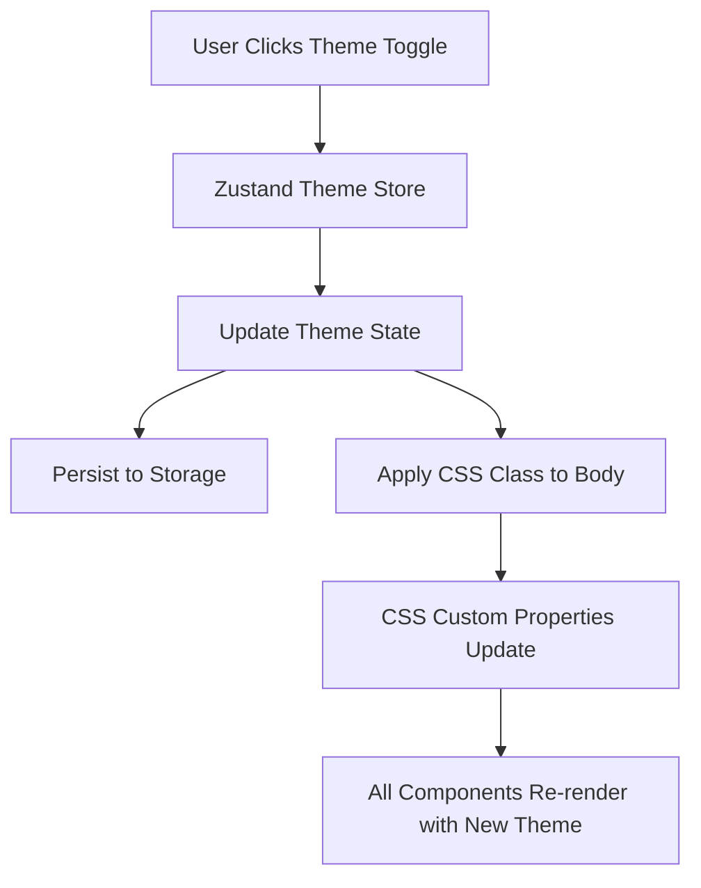

# Design Document: Dark Mode with Theme Toggle

## Overview

This design document outlines the technical approach for implementing a site-wide Dark Mode feature with a theme toggle control in the user profile dropdown menu. The implementation will use Zustand for state management with persistence, CSS Custom Properties for dynamic theming, and React Bootstrap components for the toggle UI.

### Design Goals

1. Provide a seamless dark mode experience across all application pages and components
2. Persist user theme preference using Zustand's persist middleware
3. Minimize code changes by leveraging CSS Custom Properties
4. Ensure accessibility compliance (WCAG 2.1 Level AA)
5. Maintain consistency with existing application architecture

## Architecture

### High-Level Architecture



### Component Hierarchy

```
App.js
├── ThemeProvider (new)
│   └── useThemeStore hook
├── LoginForm
│   └── Uses CSS variables
└── TodoList
    ├── Profile Dropdown
    │   └── ThemeToggle (new)
    ├── ChatModal
    │   └── Uses CSS variables
    └── Other Components
        └── Use CSS variables
```

## Components and Interfaces

### 1. Theme Store (Zustand)

**File**: `client/src/stores/themeStore.js`

**Purpose**: Centralized theme state management with persistence

**Interface**:
```javascript
{
  theme: 'light' | 'dark',
  toggleTheme: () => void,
  setTheme: (theme: 'light' | 'dark') => void,
  initializeTheme: () => void
}
```

**Implementation Details**:
- Use Zustand's `persist` middleware with `localStorage` storage
- Storage key: `'theme-storage'`
- Default theme: `'light'`
- On theme change, update `document.documentElement.setAttribute('data-theme', theme)`
- Respect system preference if no saved theme exists using `window.matchMedia('(prefers-color-scheme: dark)')`

**Code Structure**:
```javascript
import { create } from 'zustand';
import { persist, createJSONStorage } from 'zustand/middleware';

export const useThemeStore = create(
  persist(
    (set, get) => ({
      theme: 'light',
      
      toggleTheme: () => {
        const newTheme = get().theme === 'light' ? 'dark' : 'light';
        set({ theme: newTheme });
        document.documentElement.setAttribute('data-theme', newTheme);
      },
      
      setTheme: (theme) => {
        set({ theme });
        document.documentElement.setAttribute('data-theme', theme);
      },
      
      initializeTheme: () => {
        const { theme } = get();
        // Check if there's a saved theme, otherwise use system preference
        if (!theme) {
          const prefersDark = window.matchMedia('(prefers-color-scheme: dark)').matches;
          const initialTheme = prefersDark ? 'dark' : 'light';
          set({ theme: initialTheme });
          document.documentElement.setAttribute('data-theme', initialTheme);
        } else {
          document.documentElement.setAttribute('data-theme', theme);
        }
      }
    }),
    {
      name: 'theme-storage',
      storage: createJSONStorage(() => localStorage),
    }
  )
);
```

### 2. Theme Toggle Component

**File**: `client/src/components/ThemeToggle.js`

**Purpose**: Toggle switch UI for theme selection in profile dropdown

**Props**: None (uses Zustand store directly)

**Implementation Details**:
- Use React Bootstrap Form.Check with switch variant
- Display "다크 모드" label
- Show current theme state visually
- Prevent dropdown from closing when toggled
- Accessible with keyboard navigation

**Code Structure**:
```javascript
import React from 'react';
import { Form } from 'react-bootstrap';
import { useThemeStore } from '../stores/themeStore';
import './ThemeToggle.css';

const ThemeToggle = () => {
  const { theme, toggleTheme } = useThemeStore();
  
  const handleToggle = (e) => {
    e.stopPropagation(); // Prevent dropdown from closing
    toggleTheme();
  };
  
  return (
    <div className="theme-toggle-container" onClick={handleToggle}>
      <Form.Check
        type="switch"
        id="theme-toggle"
        label="다크 모드"
        checked={theme === 'dark'}
        onChange={() => {}} // Handled by container click
        aria-label="다크 모드 전환"
      />
    </div>
  );
};

export default ThemeToggle;
```

### 3. Theme Initialization Hook

**File**: `client/src/App.js` (modified)

**Purpose**: Initialize theme on app startup

**Implementation**:
```javascript
import { useEffect } from 'react';
import { useThemeStore } from './stores/themeStore';

function App() {
  const { user } = useAuthStore();
  const initializeTheme = useThemeStore((state) => state.initializeTheme);
  
  useEffect(() => {
    initializeTheme();
  }, [initializeTheme]);
  
  return <>{user ? <TodoList /> : <LoginForm />}</>;
}
```

### 4. Profile Dropdown Integration

**File**: `client/src/todoList/TodoList.js` (modified)

**Location**: Between "비밀번호 변경" and "로그아웃" buttons

**Implementation**:
```javascript
import ThemeToggle from '../components/ThemeToggle';

// Inside the user dropdown menu JSX:
<div className="user-dropdown-menu">
  <button className="dropdown-item" onClick={handleUpdateProfile}>
    프로필 수정
  </button>
  <button className="dropdown-item" onClick={handleChangePassword}>
    비밀번호 변경
  </button>
  <div className="dropdown-divider"></div>
  <ThemeToggle />
  <div className="dropdown-divider"></div>
  <button className="dropdown-item" onClick={handleLogout}>
    로그아웃
  </button>
</div>
```

## Data Models

### Theme State Model

```typescript
interface ThemeState {
  theme: 'light' | 'dark';
  toggleTheme: () => void;
  setTheme: (theme: 'light' | 'dark') => void;
  initializeTheme: () => void;
}
```

### Persisted Storage Model

```json
{
  "state": {
    "theme": "light"
  },
  "version": 0
}
```

## CSS Custom Properties System

### 1. Global Theme Variables

**File**: `client/src/index.css` (modified)

**Structure**:
```css
:root {
  /* Light theme (default) */
  --bg-primary: #ffffff;
  --bg-secondary: #f8f9fa;
  --bg-tertiary: #e9ecef;
  --bg-hover: #f8f9fa;
  --bg-completed: #f0f8f0;
  
  --text-primary: #212529;
  --text-secondary: #495057;
  --text-muted: #6c757d;
  
  --border-light: #e0e0e0;
  --border-medium: #dee2e6;
  --border-separator: #f0f0f0;
  
  --color-primary: #007bff;
  --color-primary-dark: #0056b3;
  --color-danger: #dc3545;
  --color-danger-dark: #c82333;
  --color-success: #28a745;
  
  --shadow-light: 0 2px 4px rgba(0, 0, 0, 0.1);
  --shadow-medium: 0 4px 6px rgba(0, 0, 0, 0.05);
  --shadow-dropdown: 0 0.5rem 1rem rgba(0, 0, 0, 0.15);
}

[data-theme='dark'] {
  /* Dark theme */
  --bg-primary: #1a1a1a;
  --bg-secondary: #2d2d2d;
  --bg-tertiary: #3a3a3a;
  --bg-hover: #2d2d2d;
  --bg-completed: #1e3a1e;
  
  --text-primary: #e9ecef;
  --text-secondary: #adb5bd;
  --text-muted: #6c757d;
  
  --border-light: #404040;
  --border-medium: #4a4a4a;
  --border-separator: #333333;
  
  --color-primary: #4a9eff;
  --color-primary-dark: #3a8eef;
  --color-danger: #ff4757;
  --color-danger-dark: #ee3742;
  --color-success: #2ecc71;
  
  --shadow-light: 0 2px 4px rgba(0, 0, 0, 0.3);
  --shadow-medium: 0 4px 6px rgba(0, 0, 0, 0.2);
  --shadow-dropdown: 0 0.5rem 1rem rgba(0, 0, 0, 0.4);
}

body {
  background-color: var(--bg-secondary);
  color: var(--text-primary);
  transition: background-color 0.3s ease, color 0.3s ease;
}
```

### 2. Component-Specific Variable Mapping

**TodoList.css** - Replace hardcoded colors with CSS variables:
```css
:root {
  --color-white: var(--bg-primary);
  --color-border-light: var(--border-light);
  --color-border-medium: var(--border-medium);
  --color-border-separator: var(--border-separator);
  --color-bg-light: var(--bg-secondary);
  --color-bg-hover: var(--bg-hover);
  --color-bg-completed: var(--bg-completed);
  --color-text-primary: var(--text-primary);
  --color-text-secondary: var(--text-secondary);
  --color-text-muted: var(--text-muted);
  /* ... other mappings */
}
```

**LoginForm.css** - Update to use CSS variables:
```css
.login-container,
.signup-container {
  background-color: var(--bg-primary);
  border-color: var(--border-light);
  color: var(--text-primary);
}
```

**ChatModal.css** - Update to use CSS variables:
```css
.chat-modal {
  background-color: var(--bg-primary);
  color: var(--text-primary);
}

.chat-message.user {
  background-color: var(--color-primary);
}

.chat-message.assistant {
  background-color: var(--bg-secondary);
}
```

### 3. Bootstrap Component Overrides

**File**: `client/src/App.css` (modified)

**Purpose**: Override Bootstrap default styles to respect theme

```css
/* Bootstrap overrides for dark theme */
[data-theme='dark'] .btn-primary {
  background-color: var(--color-primary);
  border-color: var(--color-primary);
}

[data-theme='dark'] .btn-primary:hover {
  background-color: var(--color-primary-dark);
  border-color: var(--color-primary-dark);
}

[data-theme='dark'] .form-control {
  background-color: var(--bg-tertiary);
  border-color: var(--border-medium);
  color: var(--text-primary);
}

[data-theme='dark'] .form-control:focus {
  background-color: var(--bg-tertiary);
  border-color: var(--color-primary);
  color: var(--text-primary);
}

[data-theme='dark'] .modal-content {
  background-color: var(--bg-primary);
  color: var(--text-primary);
}

[data-theme='dark'] .dropdown-menu {
  background-color: var(--bg-primary);
  border-color: var(--border-medium);
}

[data-theme='dark'] .dropdown-item {
  color: var(--text-primary);
}

[data-theme='dark'] .dropdown-item:hover {
  background-color: var(--bg-hover);
}

[data-theme='dark'] .table {
  color: var(--text-primary);
}

[data-theme='dark'] .table-hover tbody tr:hover {
  background-color: var(--bg-hover);
}
```

## Error Handling

### Theme Initialization Errors

**Scenario**: localStorage is unavailable or blocked

**Handling**:
- Zustand persist middleware will gracefully fallback to in-memory storage
- Theme will still work but won't persist across sessions
- No error shown to user; feature degrades gracefully

### System Preference Detection Errors

**Scenario**: `window.matchMedia` is not supported

**Handling**:
```javascript
const getSystemTheme = () => {
  try {
    if (window.matchMedia && window.matchMedia('(prefers-color-scheme: dark)').matches) {
      return 'dark';
    }
  } catch (error) {
    console.warn('System theme detection failed:', error);
  }
  return 'light';
};
```

### CSS Variable Support

**Scenario**: Browser doesn't support CSS Custom Properties

**Handling**:
- Modern browsers (Chrome 49+, Firefox 31+, Safari 9.1+) all support CSS variables
- No fallback needed as application already requires modern browser features
- If needed, can add fallback colors in CSS

## Testing Strategy

### Unit Tests

**File**: `client/src/stores/themeStore.test.js`

**Test Cases**:
1. Initial theme is 'light' by default
2. `toggleTheme()` switches between 'light' and 'dark'
3. `setTheme()` sets specific theme
4. Theme persists to localStorage
5. Theme is restored from localStorage on initialization
6. System preference is respected when no saved theme exists

**File**: `client/src/components/ThemeToggle.test.js`

**Test Cases**:
1. Renders with correct label "다크 모드"
2. Switch reflects current theme state
3. Clicking toggle calls `toggleTheme()`
4. Click event doesn't propagate (dropdown stays open)
5. Keyboard accessible (Enter/Space keys work)

### Integration Tests

**File**: `client/src/App.test.js`

**Test Cases**:
1. Theme initializes on app mount
2. Theme persists across component remounts
3. Theme applies to all pages (login and todo list)

### Manual Testing Checklist

1. **Theme Toggle**
   - [ ] Toggle appears in profile dropdown between "비밀번호 변경" and "로그아웃"
   - [ ] Toggle switches theme immediately
   - [ ] Dropdown stays open when toggling
   - [ ] Toggle is keyboard accessible

2. **Theme Persistence**
   - [ ] Theme persists after page reload
   - [ ] Theme persists after logout/login
   - [ ] Theme persists across browser tabs

3. **Visual Consistency**
   - [ ] All components use theme colors
   - [ ] Text is readable in both themes
   - [ ] Contrast ratios meet WCAG AA standards
   - [ ] Hover states are visible in both themes
   - [ ] Focus indicators are visible in both themes

4. **Component Coverage**
   - [ ] Login form
   - [ ] Signup form
   - [ ] Todo list table
   - [ ] Todo form (create/edit)
   - [ ] Profile dropdown
   - [ ] Chat modal
   - [ ] File upload progress
   - [ ] Floating action button
   - [ ] Password change form
   - [ ] Profile update form

5. **Accessibility**
   - [ ] Screen reader announces theme toggle
   - [ ] Keyboard navigation works
   - [ ] Focus indicators visible
   - [ ] Color contrast meets WCAG AA

## Implementation Phases

### Phase 1: Foundation
1. Create theme store with Zustand
2. Define CSS Custom Properties for light and dark themes
3. Initialize theme in App.js

### Phase 2: UI Integration
1. Create ThemeToggle component
2. Integrate toggle into profile dropdown
3. Add visual transitions

### Phase 3: Component Migration
1. Update TodoList.css to use CSS variables
2. Update LoginForm.css to use CSS variables
3. Update ChatModal.css to use CSS variables
4. Update other component styles

### Phase 4: Bootstrap Overrides
1. Add dark theme overrides for Bootstrap components
2. Test all form controls
3. Test all buttons and modals

### Phase 5: Testing & Polish
1. Write unit tests
2. Perform manual testing
3. Fix accessibility issues
4. Optimize transitions

## Accessibility Considerations

### WCAG 2.1 Level AA Compliance

**Color Contrast**:
- Light theme: Maintain existing contrast ratios (already compliant)
- Dark theme: Ensure minimum 4.5:1 contrast for normal text, 3:1 for large text

**Contrast Ratios for Dark Theme**:
- Primary text (#e9ecef) on primary background (#1a1a1a): 13.5:1 ✓
- Secondary text (#adb5bd) on primary background (#1a1a1a): 9.2:1 ✓
- Primary button (#4a9eff) on primary background (#1a1a1a): 5.8:1 ✓

**Keyboard Navigation**:
- Theme toggle is focusable
- Enter and Space keys activate toggle
- Focus indicator visible in both themes

**Screen Reader Support**:
- Toggle has `aria-label="다크 모드 전환"`
- Theme change is announced (implicit through switch state change)

**Motion Sensitivity**:
- Transition duration: 300ms (within acceptable range)
- No auto-playing animations
- Respects `prefers-reduced-motion` media query

```css
@media (prefers-reduced-motion: reduce) {
  * {
    transition-duration: 0.01ms !important;
  }
}
```

## Performance Considerations

### CSS Variable Performance
- CSS Custom Properties have minimal performance impact
- Browser repaints are optimized for CSS variable changes
- No JavaScript-based style manipulation needed

### State Management Performance
- Zustand is lightweight (~1KB)
- Theme state changes trigger minimal re-renders
- Only components using `useThemeStore` will re-render

### Persistence Performance
- localStorage operations are synchronous but fast
- Persist middleware batches writes
- No network requests involved

## Browser Compatibility

**Minimum Requirements**:
- Chrome 49+ (CSS Variables support)
- Firefox 31+ (CSS Variables support)
- Safari 9.1+ (CSS Variables support)
- Edge 15+ (CSS Variables support)

**Note**: Application already requires modern browser features (ES6, Fetch API, etc.), so CSS Variable support is guaranteed.

## Future Enhancements

1. **Auto Theme Switching**: Automatically switch theme based on time of day
2. **Custom Themes**: Allow users to create custom color schemes
3. **Theme Preview**: Show theme preview before applying
4. **Smooth Transitions**: Add more sophisticated transition effects
5. **Per-Component Themes**: Allow different themes for different sections
