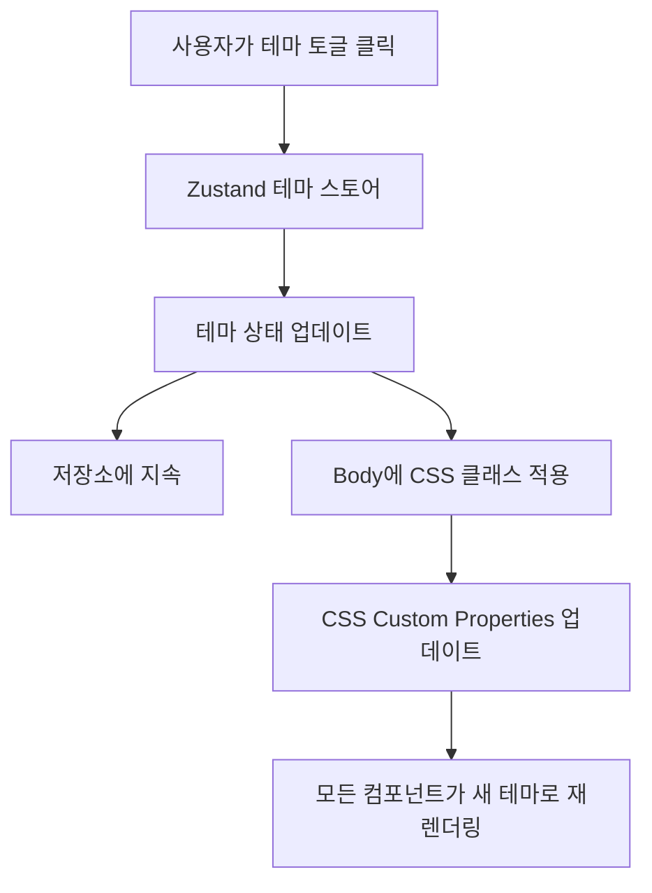

# 설계 문서: 테마 토글을 포함한 다크 모드

## 개요

이 설계 문서는 사용자 프로필 드롭다운 메뉴에 테마 토글 컨트롤을 포함한 사이트 전체 다크 모드 기능 구현을 위한 기술적 접근 방식을 설명합니다. 구현은 지속성을 갖춘 Zustand 상태 관리, 동적 테마 적용을 위한 CSS Custom Properties, 토글 UI를 위한 React Bootstrap 컴포넌트를 사용합니다.

### 설계 목표

1. 모든 애플리케이션 페이지와 컴포넌트에서 원활한 다크 모드 경험 제공
2. Zustand의 persist 미들웨어를 사용하여 사용자 테마 선호도 유지
3. CSS Custom Properties를 활용하여 코드 변경 최소화
4. 접근성 준수 보장 (WCAG 2.1 Level AA)
5. 기존 애플리케이션 아키텍처와의 일관성 유지

## 아키텍처

### 상위 수준 아키텍처



### 컴포넌트 계층 구조

```
App.js
├── ThemeProvider (신규)
│   └── useThemeStore 훅
├── LoginForm
│   └── CSS 변수 사용
└── TodoList
    ├── Profile Dropdown
    │   └── ThemeToggle (신규)
    ├── ChatModal
    │   └── CSS 변수 사용
    └── 기타 컴포넌트
        └── CSS 변수 사용
```

## 컴포넌트 및 인터페이스

### 1. 테마 스토어 (Zustand)

**파일**: `client/src/stores/themeStore.js`

**목적**: 지속성을 갖춘 중앙 집중식 테마 상태 관리

**인터페이스**:
```javascript
{
  theme: 'light' | 'dark',
  toggleTheme: () => void,
  setTheme: (theme: 'light' | 'dark') => void,
  initializeTheme: () => void
}
```

**구현 세부사항**:
- `localStorage` 저장소와 함께 Zustand의 `persist` 미들웨어 사용
- 저장소 키: `'theme-storage'`
- 기본 테마: `'light'`
- 테마 변경 시, `document.documentElement.setAttribute('data-theme', theme)` 업데이트
- 저장된 테마가 없는 경우 `window.matchMedia('(prefers-color-scheme: dark)')`를 사용하여 시스템 선호도 존중

**코드 구조**:
```javascript
import { create } from 'zustand';
import { persist, createJSONStorage } from 'zustand/middleware';

export const useThemeStore = create(
  persist(
    (set, get) => ({
      theme: 'light',
      
      toggleTheme: () => {
        const newTheme = get().theme === 'light' ? 'dark' : 'light';
        set({ theme: newTheme });
        document.documentElement.setAttribute('data-theme', newTheme);
      },
      
      setTheme: (theme) => {
        set({ theme });
        document.documentElement.setAttribute('data-theme', theme);
      },
      
      initializeTheme: () => {
        const { theme } = get();
        // 저장된 테마가 있는지 확인, 없으면 시스템 선호도 사용
        if (!theme) {
          const prefersDark = window.matchMedia('(prefers-color-scheme: dark)').matches;
          const initialTheme = prefersDark ? 'dark' : 'light';
          set({ theme: initialTheme });
          document.documentElement.setAttribute('data-theme', initialTheme);
        } else {
          document.documentElement.setAttribute('data-theme', theme);
        }
      }
    }),
    {
      name: 'theme-storage',
      storage: createJSONStorage(() => localStorage),
    }
  )
);
```

### 2. 테마 토글 컴포넌트

**파일**: `client/src/components/ThemeToggle.js`

**목적**: 프로필 드롭다운에서 테마 선택을 위한 토글 스위치 UI

**Props**: 없음 (Zustand 스토어를 직접 사용)

**구현 세부사항**:
- 스위치 변형과 함께 React Bootstrap Form.Check 사용
- "다크 모드" 레이블 표시
- 현재 테마 상태를 시각적으로 표시
- 드롭다운이 닫히지 않도록 방지
- 키보드 탐색으로 접근 가능

**코드 구조**:
```javascript
import React from 'react';
import { Form } from 'react-bootstrap';
import { useThemeStore } from '../stores/themeStore';
import './ThemeToggle.css';

const ThemeToggle = () => {
  const { theme, toggleTheme } = useThemeStore();
  
  const handleToggle = (e) => {
    e.stopPropagation(); // 드롭다운이 닫히지 않도록 방지
    toggleTheme();
  };
  
  return (
    <div className="theme-toggle-container" onClick={handleToggle}>
      <Form.Check
        type="switch"
        id="theme-toggle"
        label="다크 모드"
        checked={theme === 'dark'}
        onChange={() => {}} // 컨테이너 클릭으로 처리
        aria-label="다크 모드 전환"
      />
    </div>
  );
};

export default ThemeToggle;
```

### 3. 테마 초기화 훅

**파일**: `client/src/App.js` (수정됨)

**목적**: 앱 시작 시 테마 초기화

**구현**:
```javascript
import { useEffect } from 'react';
import { useThemeStore } from './stores/themeStore';

function App() {
  const { user } = useAuthStore();
  const initializeTheme = useThemeStore((state) => state.initializeTheme);
  
  useEffect(() => {
    initializeTheme();
  }, [initializeTheme]);
  
  return <>{user ? <TodoList /> : <LoginForm />}</>;
}
```

### 4. 프로필 드롭다운 통합

**파일**: `client/src/todoList/TodoList.js` (수정됨)

**위치**: "비밀번호 변경"과 "로그아웃" 버튼 사이

**구현**:
```javascript
import ThemeToggle from '../components/ThemeToggle';

// 사용자 드롭다운 메뉴 JSX 내부:
<div className="user-dropdown-menu">
  <button className="dropdown-item" onClick={handleUpdateProfile}>
    프로필 수정
  </button>
  <button className="dropdown-item" onClick={handleChangePassword}>
    비밀번호 변경
  </button>
  <div className="dropdown-divider"></div>
  <ThemeToggle />
  <div className="dropdown-divider"></div>
  <button className="dropdown-item" onClick={handleLogout}>
    로그아웃
  </button>
</div>
```

## 데이터 모델

### 테마 상태 모델

```typescript
interface ThemeState {
  theme: 'light' | 'dark';
  toggleTheme: () => void;
  setTheme: (theme: 'light' | 'dark') => void;
  initializeTheme: () => void;
}
```

### 지속된 저장소 모델

```json
{
  "state": {
    "theme": "light"
  },
  "version": 0
}
```

## CSS Custom Properties 시스템

### 1. 전역 테마 변수

**파일**: `client/src/index.css` (수정됨)

**구조**:
```css
:root {
  /* 라이트 테마 (기본값) */
  --bg-primary: #ffffff;
  --bg-secondary: #f8f9fa;
  --bg-tertiary: #e9ecef;
  --bg-hover: #f8f9fa;
  --bg-completed: #f0f8f0;
  
  --text-primary: #212529;
  --text-secondary: #495057;
  --text-muted: #6c757d;
  
  --border-light: #e0e0e0;
  --border-medium: #dee2e6;
  --border-separator: #f0f0f0;
  
  --color-primary: #007bff;
  --color-primary-dark: #0056b3;
  --color-danger: #dc3545;
  --color-danger-dark: #c82333;
  --color-success: #28a745;
  
  --shadow-light: 0 2px 4px rgba(0, 0, 0, 0.1);
  --shadow-medium: 0 4px 6px rgba(0, 0, 0, 0.05);
  --shadow-dropdown: 0 0.5rem 1rem rgba(0, 0, 0, 0.15);
}

[data-theme='dark'] {
  /* 다크 테마 */
  --bg-primary: #1a1a1a;
  --bg-secondary: #2d2d2d;
  --bg-tertiary: #3a3a3a;
  --bg-hover: #2d2d2d;
  --bg-completed: #1e3a1e;
  
  --text-primary: #e9ecef;
  --text-secondary: #adb5bd;
  --text-muted: #6c757d;
  
  --border-light: #404040;
  --border-medium: #4a4a4a;
  --border-separator: #333333;
  
  --color-primary: #4a9eff;
  --color-primary-dark: #3a8eef;
  --color-danger: #ff4757;
  --color-danger-dark: #ee3742;
  --color-success: #2ecc71;
  
  --shadow-light: 0 2px 4px rgba(0, 0, 0, 0.3);
  --shadow-medium: 0 4px 6px rgba(0, 0, 0, 0.2);
  --shadow-dropdown: 0 0.5rem 1rem rgba(0, 0, 0, 0.4);
}

body {
  background-color: var(--bg-secondary);
  color: var(--text-primary);
  transition: background-color 0.3s ease, color 0.3s ease;
}
```

### 2. 컴포넌트별 변수 매핑

**TodoList.css** - 하드코딩된 색상을 CSS 변수로 교체:
```css
:root {
  --color-white: var(--bg-primary);
  --color-border-light: var(--border-light);
  --color-border-medium: var(--border-medium);
  --color-border-separator: var(--border-separator);
  --color-bg-light: var(--bg-secondary);
  --color-bg-hover: var(--bg-hover);
  --color-bg-completed: var(--bg-completed);
  --color-text-primary: var(--text-primary);
  --color-text-secondary: var(--text-secondary);
  --color-text-muted: var(--text-muted);
  /* ... 기타 매핑 */
}
```

**LoginForm.css** - CSS 변수를 사용하도록 업데이트:
```css
.login-container,
.signup-container {
  background-color: var(--bg-primary);
  border-color: var(--border-light);
  color: var(--text-primary);
}
```

**ChatModal.css** - CSS 변수를 사용하도록 업데이트:
```css
.chat-modal {
  background-color: var(--bg-primary);
  color: var(--text-primary);
}

.chat-message.user {
  background-color: var(--color-primary);
}

.chat-message.assistant {
  background-color: var(--bg-secondary);
}
```

### 3. Bootstrap 컴포넌트 오버라이드

**파일**: `client/src/App.css` (수정됨)

**목적**: 테마를 존중하도록 Bootstrap 기본 스타일 오버라이드

```css
/* 다크 테마를 위한 Bootstrap 오버라이드 */
[data-theme='dark'] .btn-primary {
  background-color: var(--color-primary);
  border-color: var(--color-primary);
}

[data-theme='dark'] .btn-primary:hover {
  background-color: var(--color-primary-dark);
  border-color: var(--color-primary-dark);
}

[data-theme='dark'] .form-control {
  background-color: var(--bg-tertiary);
  border-color: var(--border-medium);
  color: var(--text-primary);
}

[data-theme='dark'] .form-control:focus {
  background-color: var(--bg-tertiary);
  border-color: var(--color-primary);
  color: var(--text-primary);
}

[data-theme='dark'] .modal-content {
  background-color: var(--bg-primary);
  color: var(--text-primary);
}

[data-theme='dark'] .dropdown-menu {
  background-color: var(--bg-primary);
  border-color: var(--border-medium);
}

[data-theme='dark'] .dropdown-item {
  color: var(--text-primary);
}

[data-theme='dark'] .dropdown-item:hover {
  background-color: var(--bg-hover);
}

[data-theme='dark'] .table {
  color: var(--text-primary);
}

[data-theme='dark'] .table-hover tbody tr:hover {
  background-color: var(--bg-hover);
}
```

## 오류 처리

### 테마 초기화 오류

**시나리오**: localStorage를 사용할 수 없거나 차단됨

**처리**:
- Zustand persist 미들웨어가 인메모리 저장소로 우아하게 폴백
- 테마는 여전히 작동하지만 세션 간 유지되지 않음
- 사용자에게 오류가 표시되지 않음; 기능이 우아하게 저하됨

### 시스템 선호도 감지 오류

**시나리오**: `window.matchMedia`가 지원되지 않음

**처리**:
```javascript
const getSystemTheme = () => {
  try {
    if (window.matchMedia && window.matchMedia('(prefers-color-scheme: dark)').matches) {
      return 'dark';
    }
  } catch (error) {
    console.warn('시스템 테마 감지 실패:', error);
  }
  return 'light';
};
```

### CSS 변수 지원

**시나리오**: 브라우저가 CSS Custom Properties를 지원하지 않음

**처리**:
- 최신 브라우저(Chrome 49+, Firefox 31+, Safari 9.1+)는 모두 CSS 변수를 지원
- 애플리케이션이 이미 최신 브라우저 기능을 요구하므로 폴백 불필요
- 필요한 경우 CSS에 폴백 색상 추가 가능

## 테스트 전략

### 단위 테스트

**파일**: `client/src/stores/themeStore.test.js`

**테스트 케이스**:
1. 초기 테마는 기본적으로 'light'
2. `toggleTheme()`이 'light'와 'dark' 간 전환
3. `setTheme()`이 특정 테마 설정
4. 테마가 localStorage에 유지됨
5. 초기화 시 localStorage에서 테마 복원
6. 저장된 테마가 없을 때 시스템 선호도 존중

**파일**: `client/src/components/ThemeToggle.test.js`

**테스트 케이스**:
1. 올바른 레이블 "다크 모드"로 렌더링
2. 스위치가 현재 테마 상태 반영
3. 토글 클릭 시 `toggleTheme()` 호출
4. 클릭 이벤트가 전파되지 않음 (드롭다운 열린 상태 유지)
5. 키보드 접근 가능 (Enter/Space 키 작동)

### 통합 테스트

**파일**: `client/src/App.test.js`

**테스트 케이스**:
1. 앱 마운트 시 테마 초기화
2. 컴포넌트 재마운트 시 테마 유지
3. 모든 페이지(로그인 및 todo 리스트)에 테마 적용

### 수동 테스트 체크리스트

1. **테마 토글**
   - [ ] "비밀번호 변경"과 "로그아웃" 사이 프로필 드롭다운에 토글 표시
   - [ ] 토글이 즉시 테마 전환
   - [ ] 토글 시 드롭다운 열린 상태 유지
   - [ ] 토글이 키보드로 접근 가능

2. **테마 지속성**
   - [ ] 페이지 새로고침 후 테마 유지
   - [ ] 로그아웃/로그인 후 테마 유지
   - [ ] 브라우저 탭 간 테마 유지

3. **시각적 일관성**
   - [ ] 모든 컴포넌트가 테마 색상 사용
   - [ ] 두 테마 모두에서 텍스트 읽기 가능
   - [ ] 대비율이 WCAG AA 기준 충족
   - [ ] 두 테마 모두에서 호버 상태 표시
   - [ ] 두 테마 모두에서 포커스 표시기 표시

4. **컴포넌트 범위**
   - [ ] 로그인 폼
   - [ ] 회원가입 폼
   - [ ] Todo 리스트 테이블
   - [ ] Todo 폼 (생성/수정)
   - [ ] 프로필 드롭다운
   - [ ] 채팅 모달
   - [ ] 파일 업로드 진행률
   - [ ] 플로팅 액션 버튼
   - [ ] 비밀번호 변경 폼
   - [ ] 프로필 업데이트 폼

5. **접근성**
   - [ ] 스크린 리더가 테마 토글 알림
   - [ ] 키보드 탐색 작동
   - [ ] 포커스 표시기 표시
   - [ ] 색상 대비가 WCAG AA 충족

## 구현 단계

### 1단계: 기초
1. Zustand로 테마 스토어 생성
2. 라이트 및 다크 테마를 위한 CSS Custom Properties 정의
3. App.js에서 테마 초기화

### 2단계: UI 통합
1. ThemeToggle 컴포넌트 생성
2. 프로필 드롭다운에 토글 통합
3. 시각적 전환 추가

### 3단계: 컴포넌트 마이그레이션
1. CSS 변수를 사용하도록 TodoList.css 업데이트
2. CSS 변수를 사용하도록 LoginForm.css 업데이트
3. CSS 변수를 사용하도록 ChatModal.css 업데이트
4. 기타 컴포넌트 스타일 업데이트

### 4단계: Bootstrap 오버라이드
1. Bootstrap 컴포넌트에 대한 다크 테마 오버라이드 추가
2. 모든 폼 컨트롤 테스트
3. 모든 버튼 및 모달 테스트

### 5단계: 테스트 및 개선
1. 단위 테스트 작성
2. 수동 테스트 수행
3. 접근성 문제 수정
4. 전환 최적화

## 접근성 고려사항

### WCAG 2.1 Level AA 준수

**색상 대비**:
- 라이트 테마: 기존 대비율 유지 (이미 준수)
- 다크 테마: 일반 텍스트는 최소 4.5:1, 큰 텍스트는 3:1 대비 보장

**다크 테마 대비율**:
- 기본 배경(#1a1a1a)의 기본 텍스트(#e9ecef): 13.5:1 ✓
- 기본 배경(#1a1a1a)의 보조 텍스트(#adb5bd): 9.2:1 ✓
- 기본 배경(#1a1a1a)의 기본 버튼(#4a9eff): 5.8:1 ✓

**키보드 탐색**:
- 테마 토글이 포커스 가능
- Enter 및 Space 키로 토글 활성화
- 두 테마 모두에서 포커스 표시기 표시

**스크린 리더 지원**:
- 토글에 `aria-label="다크 모드 전환"` 있음
- 테마 변경이 알림됨 (스위치 상태 변경을 통해 암시적으로)

**모션 민감도**:
- 전환 지속 시간: 300ms (허용 범위 내)
- 자동 재생 애니메이션 없음
- `prefers-reduced-motion` 미디어 쿼리 존중

```css
@media (prefers-reduced-motion: reduce) {
  * {
    transition-duration: 0.01ms !important;
  }
}
```

## 성능 고려사항

### CSS 변수 성능
- CSS Custom Properties는 성능 영향 최소
- 브라우저가 CSS 변수 변경에 대한 리페인트 최적화
- JavaScript 기반 스타일 조작 불필요

### 상태 관리 성능
- Zustand는 경량 (~1KB)
- 테마 상태 변경이 최소한의 재렌더링 트리거
- `useThemeStore`를 사용하는 컴포넌트만 재렌더링

### 지속성 성능
- localStorage 작업은 동기적이지만 빠름
- Persist 미들웨어가 쓰기를 일괄 처리
- 네트워크 요청 없음

## 브라우저 호환성

**최소 요구사항**:
- Chrome 49+ (CSS 변수 지원)
- Firefox 31+ (CSS 변수 지원)
- Safari 9.1+ (CSS 변수 지원)
- Edge 15+ (CSS 변수 지원)

**참고**: 애플리케이션이 이미 최신 브라우저 기능(ES6, Fetch API 등)을 요구하므로 CSS 변수 지원이 보장됩니다.

## 향후 개선사항

1. **자동 테마 전환**: 시간대에 따라 자동으로 테마 전환
2. **커스텀 테마**: 사용자가 커스텀 색상 스킴 생성 가능
3. **테마 미리보기**: 적용 전 테마 미리보기 표시
4. **부드러운 전환**: 더 정교한 전환 효과 추가
5. **컴포넌트별 테마**: 다른 섹션에 다른 테마 허용
