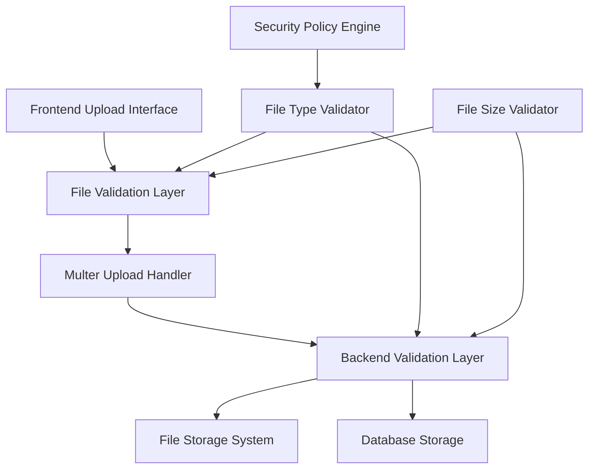
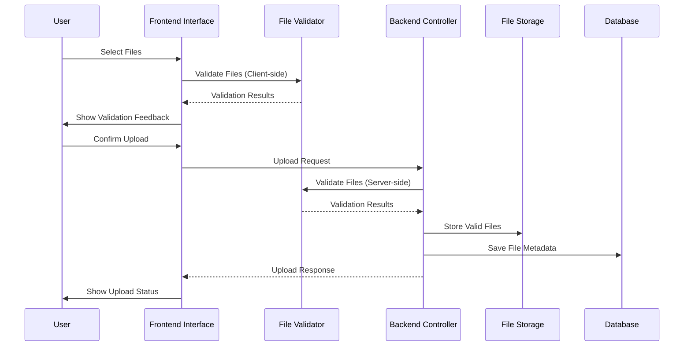

# Design Document

## Overview

This design implements comprehensive file upload policies for the TODO application by enhancing the existing file upload system with validation layers, security restrictions, and improved user experience. The solution extends the current Multer-based file upload infrastructure with configurable validators and enhanced frontend interfaces.

## Architecture

### High-Level Architecture



### Component Interaction Flow



## Components and Interfaces

### 1. File Validation System

#### FileValidationService
```typescript
interface FileValidationService {
  validateFileSize(file: File | Express.Multer.File, maxSize: number): ValidationResult;
  validateFileType(file: File | Express.Multer.File, allowedTypes: string[], blockedTypes: string[]): ValidationResult;
  validateMultipleFiles(files: File[] | Express.Multer.File[], config: ValidationConfig): ValidationResult[];
}

interface ValidationResult {
  isValid: boolean;
  errorMessage?: string;
  errorCode?: string;
}

interface ValidationConfig {
  maxFileSize: number;
  allowedExtensions: string[];
  blockedExtensions: string[];
  maxFileCount?: number;
}
```

#### FileUploadPolicyConfig
```typescript
interface FileUploadPolicyConfig {
  profileImage: {
    maxSize: number; // 10MB
    allowedTypes: string[]; // ['.jpg', '.jpeg', '.png', '.gif', '.webp']
    maxCount: number; // 1
  };
  todoAttachment: {
    maxSize: number; // 10MB
    allowedTypes: string[]; // ['.xlsx', '.pptx', '.docx', '.pdf', '.hwp', '.txt']
    blockedTypes: string[]; // ['.exe', '.js', '.msi', '.bat', '.sh', '.cmd', '.vbs']
    maxCount: number; // 10
  };
}
```

### 2. Enhanced Multer Configuration

#### CustomMulterOptions
```typescript
interface CustomMulterOptions {
  fileFilter: (req: any, file: Express.Multer.File, callback: Function) => void;
  limits: {
    fileSize: number;
    files: number;
  };
  storage: multer.StorageEngine;
}
```

### 3. Frontend Validation Components

#### FileUploadValidator (React Hook)
```typescript
interface UseFileUploadValidator {
  validateFiles: (files: FileList, config: ValidationConfig) => ValidationResult[];
  getValidFiles: (files: FileList, config: ValidationConfig) => File[];
  formatFileSize: (bytes: number) => string;
  isValidFileType: (fileName: string, allowedTypes: string[], blockedTypes: string[]) => boolean;
}
```

#### Enhanced Upload Components
- **ProfileImageUpload**: Single image file upload with preview
- **TodoAttachmentUpload**: Multiple file upload with individual validation status
- **FileValidationFeedback**: Real-time validation feedback component

### 4. Backend Integration Points

#### Enhanced Controllers
- **UserController**: Updated signup endpoint with profile image validation
- **TodoController**: New file upload endpoints for TODO attachments

#### Validation Interceptors
- **FileValidationInterceptor**: Server-side validation before processing
- **SecurityFileInterceptor**: Security-focused file type validation

## Data Models

### Enhanced FileInfoEntity
```typescript
@Entity('nj_file_info')
export class FileInfoEntity {
  // ... existing fields ...
  
  @Column({ name: 'original_file_nm', type: 'text' })
  originalFileName: string;
  
  @Column({ name: 'file_category', type: 'varchar', length: 50 })
  fileCategory: string; // 'profile_image' | 'todo_attachment'
  
  @Column({ name: 'validation_status', type: 'varchar', length: 20, default: 'pending' })
  validationStatus: string; // 'pending' | 'validated' | 'rejected'
  
  @Column({ name: 'rejection_reason', type: 'text', nullable: true })
  rejectionReason?: string;
}
```

### File Upload DTOs
```typescript
export class FileUploadDto {
  files: Express.Multer.File[];
  category: 'profile_image' | 'todo_attachment';
  associatedId?: number; // userSeq or todoSeq
}

export class FileValidationErrorDto {
  fileName: string;
  errorCode: string;
  errorMessage: string;
  fileSize?: number;
  fileType?: string;
}
```

## Error Handling

### Validation Error Codes
- `FILE_TOO_LARGE`: File exceeds maximum size limit
- `INVALID_FILE_TYPE`: File type not allowed
- `BLOCKED_FILE_TYPE`: File type is explicitly blocked for security
- `TOO_MANY_FILES`: Exceeds maximum file count
- `UPLOAD_FAILED`: General upload failure
- `STORAGE_ERROR`: File storage system error

### Error Response Format
```typescript
interface FileUploadErrorResponse {
  success: false;
  errors: FileValidationErrorDto[];
  uploadedFiles?: FileInfoEntity[];
  message: string;
}
```

### Frontend Error Handling
- Real-time validation feedback during file selection
- Clear error messages with specific reasons
- Ability to remove invalid files and retry
- Progress indicators with error states

## Testing Strategy

### Unit Tests
1. **FileValidationService Tests**
   - File size validation with various sizes
   - File type validation with allowed/blocked extensions
   - Multiple file validation scenarios

2. **Multer Configuration Tests**
   - File filter functionality
   - Size limit enforcement
   - Storage configuration

3. **Frontend Validation Tests**
   - Client-side validation logic
   - File selection and removal
   - Error message display

### Integration Tests
1. **Upload Flow Tests**
   - End-to-end profile image upload
   - End-to-end TODO attachment upload
   - Error scenarios and recovery

2. **Security Tests**
   - Blocked file type upload attempts
   - File size limit enforcement
   - Malicious file upload prevention

### Performance Tests
1. **Large File Handling**
   - Upload progress tracking
   - Memory usage during large uploads
   - Concurrent upload handling

2. **Multiple File Upload**
   - Batch validation performance
   - Storage system performance
   - Database transaction handling

## Implementation Phases

### Phase 1: Backend Validation Infrastructure
- Create FileValidationService
- Enhance multer configuration with validation
- Update FileInfoEntity with new fields
- Implement validation interceptors

### Phase 2: Frontend Validation Enhancement
- Create client-side validation hooks
- Enhance existing upload components
- Implement real-time validation feedback
- Add file preview and management features

### Phase 3: Integration and Security
- Integrate validation across all upload endpoints
- Implement security logging
- Add comprehensive error handling
- Performance optimization

### Phase 4: Testing and Documentation
- Comprehensive test suite
- User documentation
- Security audit
- Performance benchmarking