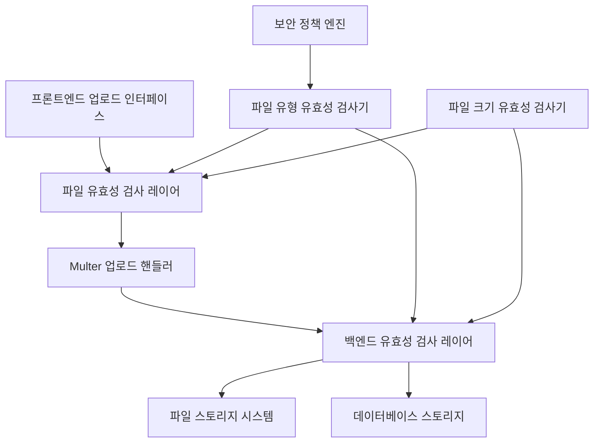
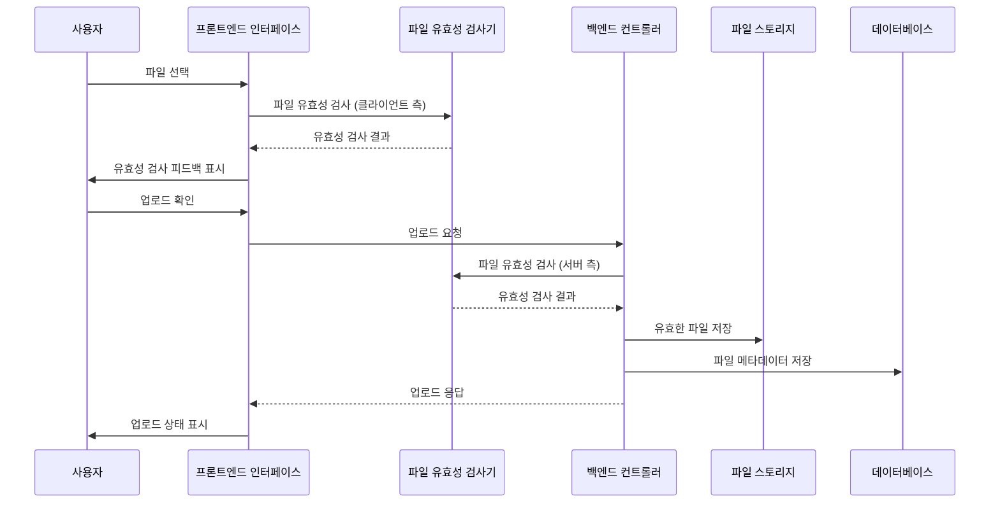

# 설계 문서

## 개요

이 설계는 유효성 검사 레이어, 보안 제한 및 개선된 사용자 경험으로 기존 파일 업로드 인프라를 강화하여 TODO 애플리케이션에 대한 포괄적인 파일 업로드 정책을 구현합니다. 솔루션은 구성 가능한 유효성 검사기 및 향상된 프론트엔드 인터페이스로 현재 Multer 기반 파일 업로드 인프라를 확장합니다.

## 아키텍처

### 고수준 아키텍처



### 컴포넌트 상호작용 흐름



## 컴포넌트 및 인터페이스

### 1. 파일 유효성 검사 시스템

#### FileValidationService
```typescript
interface FileValidationService {
  validateFileSize(file: File | Express.Multer.File, maxSize: number): ValidationResult;
  validateFileType(file: File | Express.Multer.File, allowedTypes: string[], blockedTypes: string[]): ValidationResult;
  validateMultipleFiles(files: File[] | Express.Multer.File[], config: ValidationConfig): ValidationResult[];
}

interface ValidationResult {
  isValid: boolean;
  errorMessage?: string;
  errorCode?: string;
}

interface ValidationConfig {
  maxFileSize: number;
  allowedExtensions: string[];
  blockedExtensions: string[];
  maxFileCount?: number;
}
```

#### FileUploadPolicyConfig
```typescript
interface FileUploadPolicyConfig {
  profileImage: {
    maxSize: number; // 10MB
    allowedTypes: string[]; // ['.jpg', '.jpeg', '.png', '.gif', '.webp']
    maxCount: number; // 1
  };
  todoAttachment: {
    maxSize: number; // 10MB
    allowedTypes: string[]; // ['.xlsx', '.pptx', '.docx', '.pdf', '.hwp', '.txt']
    blockedTypes: string[]; // ['.exe', '.js', '.msi', '.bat', '.sh', '.cmd', '.vbs']
    maxCount: number; // 10
  };
}
```

### 2. 향상된 Multer 구성

#### CustomMulterOptions
```typescript
interface CustomMulterOptions {
  fileFilter: (req: any, file: Express.Multer.File, callback: Function) => void;
  limits: {
    fileSize: number;
    files: number;
  };
  storage: multer.StorageEngine;
}
```

### 3. 프론트엔드 유효성 검사 컴포넌트

#### FileUploadValidator (React Hook)
```typescript
interface UseFileUploadValidator {
  validateFiles: (files: FileList, config: ValidationConfig) => ValidationResult[];
  getValidFiles: (files: FileList, config: ValidationConfig) => File[];
  formatFileSize: (bytes: number) => string;
  isValidFileType: (fileName: string, allowedTypes: string[], blockedTypes: string[]) => boolean;
}
```

#### 향상된 업로드 컴포넌트
- **ProfileImageUpload**: 미리보기가 있는 단일 이미지 파일 업로드
- **TodoAttachmentUpload**: 개별 유효성 검사 상태가 있는 여러 파일 업로드
- **FileValidationFeedback**: 실시간 유효성 검사 피드백 컴포넌트

### 4. 백엔드 통합 지점

#### 향상된 컨트롤러
- **UserController**: 프로필 이미지 유효성 검사로 업데이트된 signup 엔드포인트
- **TodoController**: TODO 첨부 파일을 위한 새로운 파일 업로드 엔드포인트

#### 유효성 검사 인터셉터
- **FileValidationInterceptor**: 처리 전 서버 측 유효성 검사
- **SecurityFileInterceptor**: 보안 중심 파일 유형 유효성 검사

## 데이터 모델

### 향상된 FileInfoEntity
```typescript
@Entity('nj_file_info')
export class FileInfoEntity {
  // ... 기존 필드 ...
  
  @Column({ name: 'original_file_nm', type: 'text' })
  originalFileName: string;
  
  @Column({ name: 'file_category', type: 'varchar', length: 50 })
  fileCategory: string; // 'profile_image' | 'todo_attachment'
  
  @Column({ name: 'validation_status', type: 'varchar', length: 20, default: 'pending' })
  validationStatus: string; // 'pending' | 'validated' | 'rejected'
  
  @Column({ name: 'rejection_reason', type: 'text', nullable: true })
  rejectionReason?: string;
}
```

### 파일 업로드 DTO
```typescript
export class FileUploadDto {
  files: Express.Multer.File[];
  category: 'profile_image' | 'todo_attachment';
  associatedId?: number; // userSeq 또는 todoSeq
}

export class FileValidationErrorDto {
  fileName: string;
  errorCode: string;
  errorMessage: string;
  fileSize?: number;
  fileType?: string;
}
```

## 오류 처리

### 유효성 검사 오류 코드
- `FILE_TOO_LARGE`: 파일이 최대 크기 제한을 초과함
- `INVALID_FILE_TYPE`: 허용되지 않는 파일 유형
- `BLOCKED_FILE_TYPE`: 보안상 명시적으로 차단된 파일 유형
- `TOO_MANY_FILES`: 최대 파일 수 초과
- `UPLOAD_FAILED`: 일반 업로드 실패
- `STORAGE_ERROR`: 파일 스토리지 시스템 오류

### 오류 응답 형식
```typescript
interface FileUploadErrorResponse {
  success: false;
  errors: FileValidationErrorDto[];
  uploadedFiles?: FileInfoEntity[];
  message: string;
}
```

### 프론트엔드 오류 처리
- 파일 선택 중 실시간 유효성 검사 피드백
- 특정 이유가 있는 명확한 오류 메시지
- 잘못된 파일을 제거하고 재시도할 수 있는 기능
- 오류 상태가 있는 진행 표시기

## 테스트 전략

### 단위 테스트
1. **FileValidationService 테스트**
   - 다양한 크기로 파일 크기 유효성 검사
   - 허용/차단된 확장자로 파일 유형 유효성 검사
   - 여러 파일 유효성 검사 시나리오

2. **Multer 구성 테스트**
   - 파일 필터 기능
   - 크기 제한 적용
   - 스토리지 구성

3. **프론트엔드 유효성 검사 테스트**
   - 클라이언트 측 유효성 검사 로직
   - 파일 선택 및 제거
   - 오류 메시지 표시

### 통합 테스트
1. **업로드 흐름 테스트**
   - 엔드투엔드 프로필 이미지 업로드
   - 엔드투엔드 TODO 첨부 파일 업로드
   - 오류 시나리오 및 복구

2. **보안 테스트**
   - 차단된 파일 유형 업로드 시도
   - 파일 크기 제한 적용
   - 악의적인 파일 업로드 방지

### 성능 테스트
1. **대용량 파일 처리**
   - 업로드 진행 추적
   - 대용량 업로드 중 메모리 사용
   - 동시 업로드 처리

2. **여러 파일 업로드**
   - 일괄 유효성 검사 성능
   - 스토리지 시스템 성능
   - 데이터베이스 트랜잭션 처리

## 구현 단계

### 1단계: 백엔드 유효성 검사 인프라
- FileValidationService 생성
- 유효성 검사로 multer 구성 강화
- 새 필드로 FileInfoEntity 업데이트
- 유효성 검사 인터셉터 구현

### 2단계: 프론트엔드 유효성 검사 강화
- 클라이언트 측 유효성 검사 훅 생성
- 기존 업로드 컴포넌트 강화
- 실시간 유효성 검사 피드백 구현
- 파일 미리보기 및 관리 기능 추가

### 3단계: 통합 및 보안
- 모든 업로드 엔드포인트에 유효성 검사 통합
- 보안 로깅 구현
- 포괄적인 오류 처리 추가
- 성능 최적화

### 4단계: 테스트 및 문서화
- 포괄적인 테스트 스위트
- 사용자 문서
- 보안 감사
- 성능 벤치마킹
