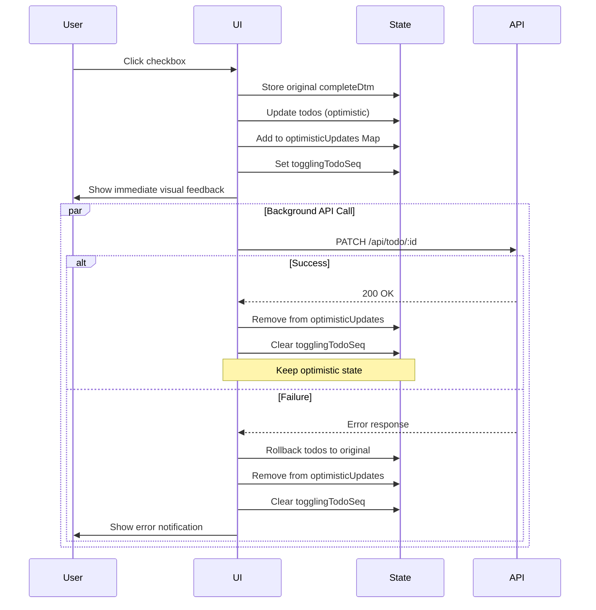

# Design Document

## Overview

This design document outlines the implementation of an Optimistic UI Update pattern for the Todo completion toggle functionality in the Todo List application. The current implementation uses a pessimistic approach where the UI waits for server confirmation before updating, resulting in perceived lag. The optimistic approach will immediately update the UI while handling the server request in the background, with automatic rollback on failure.

## Architecture

### Current Flow (Pessimistic)
1. User clicks checkbox
2. Set loading state (`togglingTodoSeq`)
3. Send API request to server
4. Wait for response
5. On success: Fetch entire todo list from server
6. Update UI with new data
7. Clear loading state

### New Flow (Optimistic)
1. User clicks checkbox
2. **Immediately update local state** (optimistic update)
3. Set loading state to prevent duplicate clicks
4. Send API request to server in background
5. On success: Clear loading state, keep optimistic state
6. On failure: **Rollback to original state**, show error notification, clear loading state

## Components and Interfaces

### Modified Component: TodoContainer

#### New State Management

```javascript
// Add new state for tracking optimistic updates
const [optimisticUpdates, setOptimisticUpdates] = useState(new Map());
```

The `optimisticUpdates` Map will store:
- Key: `todoSeq` (number)
- Value: Object containing:
  - `originalCompleteDtm`: The original completion date/time before optimistic update
  - `newCompleteDtm`: The optimistically applied completion date/time
  - `timestamp`: When the optimistic update was made (for timeout handling)

#### Modified Handler: handleToggleComplete

**Function Signature:**
```javascript
const handleToggleComplete = async (todoSeq, isCompleted) => {
  // Implementation details below
}
```

**Implementation Steps:**

1. **Prevent Duplicate Requests**
   - Check if `togglingTodoSeq === todoSeq` or if `optimisticUpdates.has(todoSeq)`
   - If true, return early (request already in progress)

2. **Store Original State**
   - Find the todo item in the `todos` array
   - Store original `completeDtm` value for potential rollback

3. **Optimistic UI Update**
   - Calculate new `completeDtm`: `isCompleted ? null : new Date().toISOString()`
   - Update `todos` state immediately with new completion status
   - Add entry to `optimisticUpdates` Map
   - Set `togglingTodoSeq` to prevent duplicate clicks

4. **Background API Call**
   - Send PATCH request to `/api/todo/${todoSeq}`
   - Use try-catch for error handling
   - Implement 30-second timeout using AbortController

5. **Handle Success**
   - Remove entry from `optimisticUpdates` Map
   - Clear `togglingTodoSeq`
   - No need to fetch todos (UI already correct)
   - Log success to console

6. **Handle Failure**
   - Rollback: Update `todos` state with original `completeDtm`
   - Remove entry from `optimisticUpdates` Map
   - Clear `togglingTodoSeq`
   - Display user-friendly error notification using SweetAlert2
   - Log error details to console

### Helper Functions

#### updateTodoOptimistically

```javascript
const updateTodoOptimistically = (todoSeq, newCompleteDtm) => {
  setTodos(prevTodos => 
    prevTodos.map(todo => 
      todo.todoSeq === todoSeq 
        ? { ...todo, completeDtm: newCompleteDtm }
        : todo
    )
  );
}
```

Purpose: Immutably update a specific todo's completion status in the todos array.

#### rollbackTodoUpdate

```javascript
const rollbackTodoUpdate = (todoSeq, originalCompleteDtm) => {
  setTodos(prevTodos => 
    prevTodos.map(todo => 
      todo.todoSeq === todoSeq 
        ? { ...todo, completeDtm: originalCompleteDtm }
        : todo
    )
  );
}
```

Purpose: Revert a todo's completion status to its original value.

#### getErrorMessage

```javascript
const getErrorMessage = (error, response) => {
  if (error.name === 'AbortError') {
    return '요청 시간이 초과되었습니다. 네트워크 연결을 확인하고 다시 시도해주세요.';
  }
  if (error.name === 'TypeError' && error.message.includes('fetch')) {
    return '네트워크 연결을 확인해주세요.';
  }
  if (response && response.status >= 500) {
    return '서버 오류가 발생했습니다. 잠시 후 다시 시도해주세요.';
  }
  return '상태 변경에 실패했습니다. 다시 시도해주세요.';
}
```

Purpose: Generate user-friendly error messages based on error type.

## Data Models

### OptimisticUpdate Interface

```typescript
interface OptimisticUpdate {
  originalCompleteDtm: string | null;  // ISO date string or null
  newCompleteDtm: string | null;       // ISO date string or null
  timestamp: number;                    // Unix timestamp in milliseconds
}
```

### Todo Item (Existing)

```typescript
interface Todo {
  todoSeq: number;
  todoContent: string;
  todoNote: string;
  completeDtm: string | null;  // ISO date string or null
  todoDate: string;             // YYYY-MM-DD format
  // ... other fields
}
```

## Error Handling

### Error Categories

1. **Network Errors**
   - Timeout (30 seconds)
   - Connection failure
   - DNS resolution failure
   - Message: "네트워크 연결을 확인해주세요."

2. **Server Errors (5xx)**
   - Internal server error
   - Service unavailable
   - Message: "서버 오류가 발생했습니다. 잠시 후 다시 시도해주세요."

3. **Client Errors (4xx)**
   - Unauthorized (401)
   - Not found (404)
   - Bad request (400)
   - Message: "상태 변경에 실패했습니다. 다시 시도해주세요."

### Error Notification

Use SweetAlert2 Toast for non-intrusive error notifications:

```javascript
Swal.fire({
  toast: true,
  position: 'top-end',
  icon: 'error',
  title: errorMessage,
  showConfirmButton: false,
  timer: 4000,
  timerProgressBar: true
});
```

### Logging Strategy

All errors and rollbacks should be logged to console with context:

```javascript
console.error('Todo toggle failed:', {
  todoSeq,
  error: error.message,
  originalState: originalCompleteDtm,
  attemptedState: newCompleteDtm,
  timestamp: new Date().toISOString()
});
```

## Testing Strategy

### Unit Testing Approach

Focus on testing the core logic of optimistic updates and rollbacks:

1. **Test: Optimistic Update Applied Immediately**
   - Verify todos state updates before API call completes
   - Verify checkbox reflects new state immediately

2. **Test: Successful API Call Maintains State**
   - Mock successful API response
   - Verify todos state remains unchanged after success
   - Verify optimisticUpdates Map is cleared

3. **Test: Failed API Call Triggers Rollback**
   - Mock failed API response
   - Verify todos state reverts to original
   - Verify error notification is displayed

4. **Test: Duplicate Click Prevention**
   - Verify second click is ignored while first request is pending
   - Verify togglingTodoSeq prevents duplicate requests

5. **Test: Multiple Independent Toggles**
   - Toggle multiple different todos rapidly
   - Verify each maintains independent state
   - Verify rollbacks are independent

### Manual Testing Scenarios

1. **Happy Path**
   - Click checkbox → Verify immediate visual feedback
   - Wait for API response → Verify no UI flicker

2. **Network Failure**
   - Disconnect network
   - Click checkbox → Verify immediate update
   - Wait for timeout → Verify rollback and error message

3. **Slow Network**
   - Throttle network to 3G
   - Click checkbox → Verify immediate response
   - Verify no duplicate requests

4. **Rapid Toggling**
   - Click same checkbox rapidly
   - Verify only one request is sent
   - Click different checkboxes rapidly
   - Verify all requests are sent independently

## Implementation Notes

### Performance Considerations

1. **State Updates**: Use functional setState to avoid race conditions
2. **Map vs Object**: Use Map for optimisticUpdates for better performance with frequent additions/deletions
3. **Immutability**: Always create new arrays/objects when updating state
4. **Cleanup**: Remove optimisticUpdates entries immediately after resolution

### Accessibility

1. Maintain `disabled` attribute on checkbox during pending state
2. Ensure visual feedback is not solely color-based
3. Maintain keyboard navigation support

### Browser Compatibility

- AbortController: Supported in all modern browsers (Chrome 66+, Firefox 57+, Safari 12.1+)
- Map: Supported in all modern browsers
- No polyfills required for target environment

### Migration Strategy

1. Implement new handler alongside existing one
2. Test thoroughly in development
3. Deploy to production
4. Monitor error rates and rollback frequency
5. Remove old pessimistic code after validation period

## Visual Feedback Design

### Loading State Indicators

- Checkbox remains interactive but disabled during pending state
- No spinner needed (optimistic update provides immediate feedback)
- Subtle opacity change (0.7) on row during pending state (optional)

### Success State

- No additional feedback needed (UI already reflects correct state)
- Checkbox animation completes normally

### Error State

- Toast notification appears in top-right corner
- Checkbox reverts to original state with subtle animation
- Row briefly highlights in light red (optional, 1-second fade)

## Sequence Diagram



## Dependencies

### Existing Dependencies (No Changes)
- React 19
- SweetAlert2
- Axios (via api wrapper)

### No New Dependencies Required

All functionality can be implemented using existing libraries and native browser APIs.
