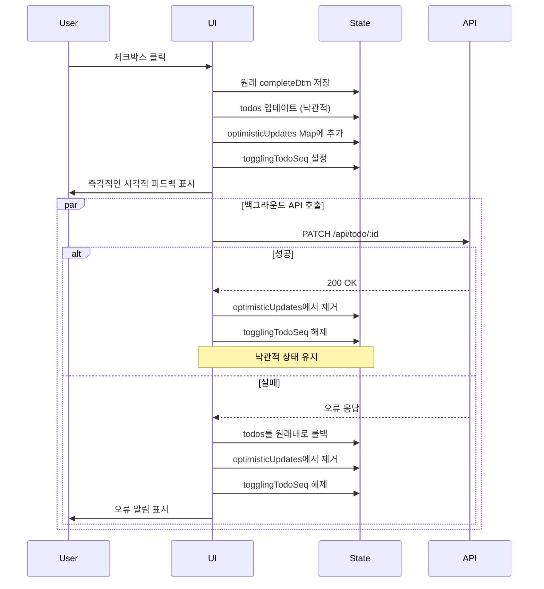

# 설계 문서

## 개요

이 설계 문서는 Todo List 애플리케이션의 Todo 완료 토글 기능에 대한 낙관적 UI 업데이트 패턴의 구현을 설명합니다. 현재 구현은 UI가 서버 확인을 기다린 후 업데이트하는 비관적 접근 방식을 사용하여 지연이 발생합니다. 낙관적 접근 방식은 서버 요청을 백그라운드에서 처리하면서 UI를 즉시 업데이트하며, 실패 시 자동 롤백을 수행합니다.

## 아키텍처

### 현재 흐름 (비관적)
1. 사용자가 체크박스 클릭
2. 로딩 상태 설정 (`togglingTodoSeq`)
3. 서버에 API 요청 전송
4. 응답 대기
5. 성공 시: 서버에서 전체 todo 목록 가져오기
6. 새 데이터로 UI 업데이트
7. 로딩 상태 해제

### 새로운 흐름 (낙관적)
1. 사용자가 체크박스 클릭
2. **로컬 상태 즉시 업데이트** (낙관적 업데이트)
3. 중복 클릭 방지를 위한 로딩 상태 설정
4. 백그라운드에서 서버에 API 요청 전송
5. 성공 시: 로딩 상태 해제, 낙관적 상태 유지
6. 실패 시: **원래 상태로 롤백**, 오류 알림 표시, 로딩 상태 해제

## 컴포넌트 및 인터페이스

### 수정된 컴포넌트: TodoContainer

#### 새로운 상태 관리

```javascript
// 낙관적 업데이트 추적을 위한 새로운 상태 추가
const [optimisticUpdates, setOptimisticUpdates] = useState(new Map());
```

`optimisticUpdates` Map은 다음을 저장합니다:
- Key: `todoSeq` (number)
- Value: 다음을 포함하는 객체:
  - `originalCompleteDtm`: 낙관적 업데이트 전 원래 완료 날짜/시간
  - `newCompleteDtm`: 낙관적으로 적용된 완료 날짜/시간
  - `timestamp`: 낙관적 업데이트가 수행된 시간 (타임아웃 처리용)

#### 수정된 핸들러: handleToggleComplete

**함수 시그니처:**
```javascript
const handleToggleComplete = async (todoSeq, isCompleted) => {
  // 구현 세부사항은 아래 참조
}
```

**구현 단계:**

1. **중복 요청 방지**
   - `togglingTodoSeq === todoSeq` 또는 `optimisticUpdates.has(todoSeq)` 확인
   - true인 경우, 조기 반환 (이미 진행 중인 요청)

2. **원래 상태 저장**
   - `todos` 배열에서 todo 항목 찾기
   - 잠재적 롤백을 위해 원래 `completeDtm` 값 저장

3. **낙관적 UI 업데이트**
   - 새로운 `completeDtm` 계산: `isCompleted ? null : new Date().toISOString()`
   - 새로운 완료 상태로 `todos` 상태 즉시 업데이트
   - `optimisticUpdates` Map에 항목 추가
   - 중복 클릭 방지를 위해 `togglingTodoSeq` 설정

4. **백그라운드 API 호출**
   - `/api/todo/${todoSeq}`로 PATCH 요청 전송
   - 오류 처리를 위한 try-catch 사용
   - AbortController를 사용한 30초 타임아웃 구현

5. **성공 처리**
   - `optimisticUpdates` Map에서 항목 제거
   - `togglingTodoSeq` 해제
   - todos 가져오기 불필요 (UI가 이미 올바름)
   - 콘솔에 성공 로그

6. **실패 처리**
   - 롤백: 원래 `completeDtm`으로 `todos` 상태 업데이트
   - `optimisticUpdates` Map에서 항목 제거
   - `togglingTodoSeq` 해제
   - SweetAlert2를 사용한 사용자 친화적 오류 알림 표시
   - 콘솔에 오류 세부사항 로그

### 헬퍼 함수

#### updateTodoOptimistically

```javascript
const updateTodoOptimistically = (todoSeq, newCompleteDtm) => {
  setTodos(prevTodos => 
    prevTodos.map(todo => 
      todo.todoSeq === todoSeq 
        ? { ...todo, completeDtm: newCompleteDtm }
        : todo
    )
  );
}
```

목적: todos 배열에서 특정 todo의 완료 상태를 불변적으로 업데이트합니다.

#### rollbackTodoUpdate

```javascript
const rollbackTodoUpdate = (todoSeq, originalCompleteDtm) => {
  setTodos(prevTodos => 
    prevTodos.map(todo => 
      todo.todoSeq === todoSeq 
        ? { ...todo, completeDtm: originalCompleteDtm }
        : todo
    )
  );
}
```

목적: todo의 완료 상태를 원래 값으로 되돌립니다.

#### getErrorMessage

```javascript
const getErrorMessage = (error, response) => {
  if (error.name === 'AbortError') {
    return '요청 시간이 초과되었습니다. 네트워크 연결을 확인하고 다시 시도해주세요.';
  }
  if (error.name === 'TypeError' && error.message.includes('fetch')) {
    return '네트워크 연결을 확인해주세요.';
  }
  if (response && response.status >= 500) {
    return '서버 오류가 발생했습니다. 잠시 후 다시 시도해주세요.';
  }
  return '상태 변경에 실패했습니다. 다시 시도해주세요.';
}
```

목적: 오류 유형에 따라 사용자 친화적인 오류 메시지를 생성합니다.

## 데이터 모델

### OptimisticUpdate 인터페이스

```typescript
interface OptimisticUpdate {
  originalCompleteDtm: string | null;  // ISO 날짜 문자열 또는 null
  newCompleteDtm: string | null;       // ISO 날짜 문자열 또는 null
  timestamp: number;                    // 밀리초 단위 Unix 타임스탬프
}
```

### Todo 항목 (기존)

```typescript
interface Todo {
  todoSeq: number;
  todoContent: string;
  todoNote: string;
  completeDtm: string | null;  // ISO 날짜 문자열 또는 null
  todoDate: string;             // YYYY-MM-DD 형식
  // ... 기타 필드
}
```

## 오류 처리

### 오류 카테고리

1. **네트워크 오류**
   - 타임아웃 (30초)
   - 연결 실패
   - DNS 해석 실패
   - 메시지: "네트워크 연결을 확인해주세요."

2. **서버 오류 (5xx)**
   - 내부 서버 오류
   - 서비스 사용 불가
   - 메시지: "서버 오류가 발생했습니다. 잠시 후 다시 시도해주세요."

3. **클라이언트 오류 (4xx)**
   - 인증되지 않음 (401)
   - 찾을 수 없음 (404)
   - 잘못된 요청 (400)
   - 메시지: "상태 변경에 실패했습니다. 다시 시도해주세요."

### 오류 알림

비침입적 오류 알림을 위해 SweetAlert2 Toast 사용:

```javascript
Swal.fire({
  toast: true,
  position: 'top-end',
  icon: 'error',
  title: errorMessage,
  showConfirmButton: false,
  timer: 4000,
  timerProgressBar: true
});
```

### 로깅 전략

모든 오류와 롤백은 컨텍스트와 함께 콘솔에 로그되어야 합니다:

```javascript
console.error('Todo toggle failed:', {
  todoSeq,
  error: error.message,
  originalState: originalCompleteDtm,
  attemptedState: newCompleteDtm,
  timestamp: new Date().toISOString()
});
```

## 테스트 전략

### 단위 테스트 접근 방식

낙관적 업데이트 및 롤백의 핵심 로직 테스트에 집중:

1. **테스트: 낙관적 업데이트 즉시 적용**
   - API 호출 완료 전에 todos 상태가 업데이트되는지 확인
   - 체크박스가 즉시 새 상태를 반영하는지 확인

2. **테스트: 성공적인 API 호출이 상태 유지**
   - 성공적인 API 응답 모킹
   - 성공 후 todos 상태가 변경되지 않는지 확인
   - optimisticUpdates Map이 지워지는지 확인

3. **테스트: 실패한 API 호출이 롤백 트리거**
   - 실패한 API 응답 모킹
   - todos 상태가 원래대로 되돌아가는지 확인
   - 오류 알림이 표시되는지 확인

4. **테스트: 중복 클릭 방지**
   - 첫 번째 요청이 진행 중일 때 두 번째 클릭이 무시되는지 확인
   - togglingTodoSeq가 중복 요청을 방지하는지 확인

5. **테스트: 여러 독립적인 토글**
   - 여러 다른 todos를 빠르게 토글
   - 각각이 독립적인 상태를 유지하는지 확인
   - 롤백이 독립적인지 확인

### 수동 테스트 시나리오

1. **정상 경로**
   - 체크박스 클릭 → 즉각적인 시각적 피드백 확인
   - API 응답 대기 → UI 깜빡임 없음 확인

2. **네트워크 실패**
   - 네트워크 연결 해제
   - 체크박스 클릭 → 즉각적인 업데이트 확인
   - 타임아웃 대기 → 롤백 및 오류 메시지 확인

3. **느린 네트워크**
   - 네트워크를 3G로 제한
   - 체크박스 클릭 → 즉각적인 응답 확인
   - 중복 요청 없음 확인

4. **빠른 토글**
   - 같은 체크박스를 빠르게 클릭
   - 하나의 요청만 전송되는지 확인
   - 다른 체크박스들을 빠르게 클릭
   - 모든 요청이 독립적으로 전송되는지 확인

## 구현 참고사항

### 성능 고려사항

1. **상태 업데이트**: 경쟁 조건을 피하기 위해 함수형 setState 사용
2. **Map vs Object**: 빈번한 추가/삭제를 위해 optimisticUpdates에 Map 사용하여 더 나은 성능
3. **불변성**: 상태 업데이트 시 항상 새로운 배열/객체 생성
4. **정리**: 해결 후 즉시 optimisticUpdates 항목 제거

### 접근성

1. 대기 상태 동안 체크박스의 `disabled` 속성 유지
2. 시각적 피드백이 색상에만 의존하지 않도록 보장
3. 키보드 탐색 지원 유지

### 브라우저 호환성

- AbortController: 모든 최신 브라우저에서 지원 (Chrome 66+, Firefox 57+, Safari 12.1+)
- Map: 모든 최신 브라우저에서 지원
- 대상 환경에 폴리필 불필요

### 마이그레이션 전략

1. 기존 핸들러와 함께 새 핸들러 구현
2. 개발 환경에서 철저히 테스트
3. 프로덕션에 배포
4. 오류율 및 롤백 빈도 모니터링
5. 검증 기간 후 이전 비관적 코드 제거

## 시각적 피드백 디자인

### 로딩 상태 표시기

- 체크박스는 대기 상태 동안 상호작용 가능하지만 비활성화됨
- 스피너 불필요 (낙관적 업데이트가 즉각적인 피드백 제공)
- 대기 상태 동안 행에 미묘한 불투명도 변경 (0.7) (선택사항)

### 성공 상태

- 추가 피드백 불필요 (UI가 이미 올바른 상태 반영)
- 체크박스 애니메이션이 정상적으로 완료됨

### 오류 상태

- 오른쪽 상단에 토스트 알림 표시
- 체크박스가 미묘한 애니메이션과 함께 원래 상태로 되돌아감
- 행이 연한 빨간색으로 잠깐 강조됨 (선택사항, 1초 페이드)

## 시퀀스 다이어그램



## 의존성

### 기존 의존성 (변경 없음)
- React 19
- SweetAlert2
- Axios (api wrapper를 통해)

### 새로운 의존성 불필요

모든 기능은 기존 라이브러리와 네이티브 브라우저 API를 사용하여 구현할 수 있습니다.
